# influx_vs_victoriametrics_cluster_test_report

## 环境

- **Prometheus**: 178.104.163.111		 2c4g

- **k8s集群**：178.104.163.88

  > docker version:20.10.16  k8s version: 1.20.6

- **influxdb-cluster**

178.104.163.151 influx-1 		2c4g
178.104.163.26  influx-2 		 4c8g
178.104.163.53  influx-3  		4c8g

> 内核版本：3.10.0-862.el7.x86_64
>
> docker version：20.10.17

**架构图**

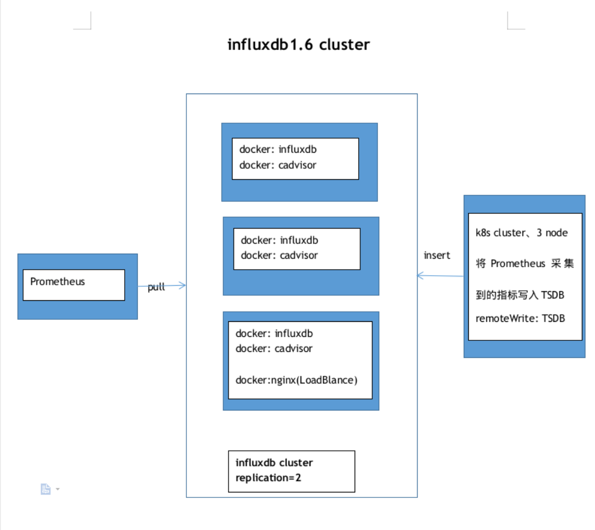


- **victoriametrics-cluster**

178.104.163.177  tsdb1 	  2c4g
178.104.163.76   tsdb2		4c8g
178.104.163.113  tsdb3		4c8g

**架构图**

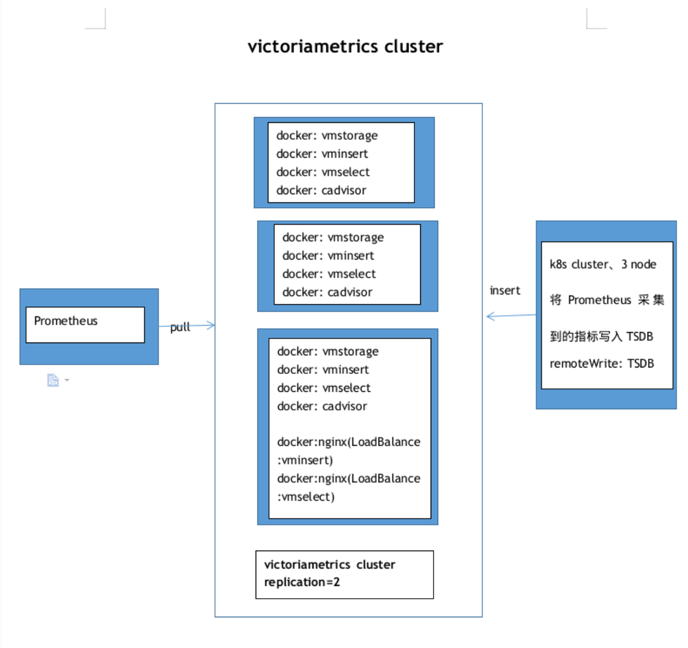

## 部署方式

- [influxdb_cluster 部署方式](influx_1.6_cluster/README.md)
- [victoriametrics_cluster 部署方式](vmcluster/README.md)

## 测试结果

>  运行时间三天

```sh
# 磁盘本地存储
[root@influx-1 ~]# du -sh /var/lib/influxdb/
1.5G    /var/lib/influxdb/
[root@influx-2 ~]# du -sh /var/lib/influxdb/
707M    /var/lib/influxdb/
[root@influx-3 ~]# du -sh /var/lib/influxdb/
1.7G    /var/lib/influxdb/
--------------------------------
[root@tsdb-cluster-3 ~]# du -sh /var/lib/vm
122M    /var/lib/vm
[root@tsdb-cluster-2 ~]# du -sh /var/lib/vm
174M    /var/lib/vm
[root@tsdb-cluster-1 ~]#  du -sh /var/lib/vm
199M    /var/lib/vm
```

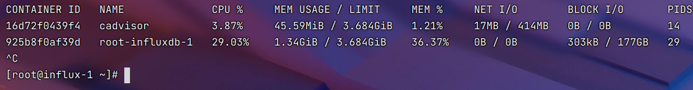

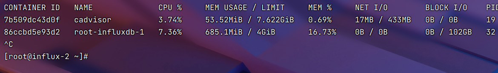

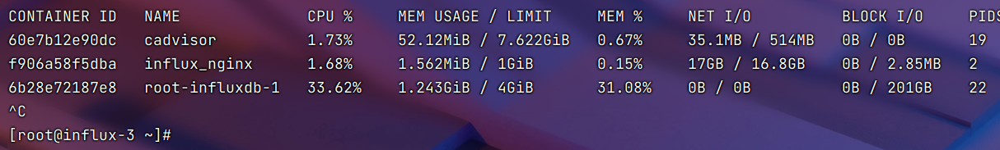

---
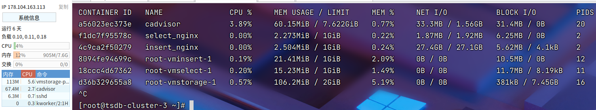

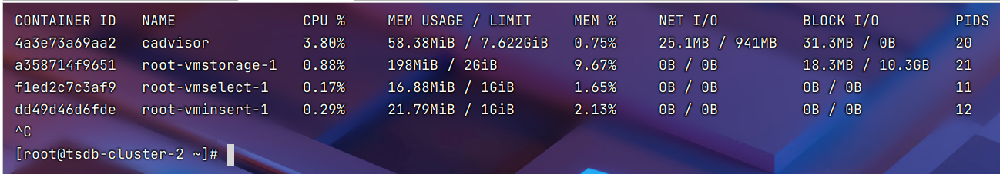

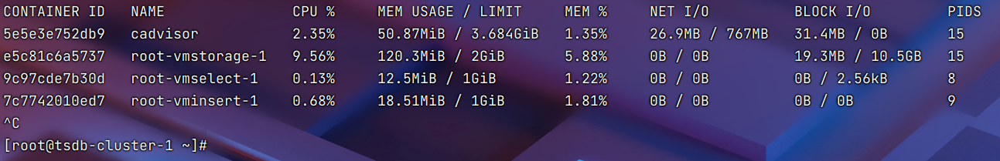


- CPU

  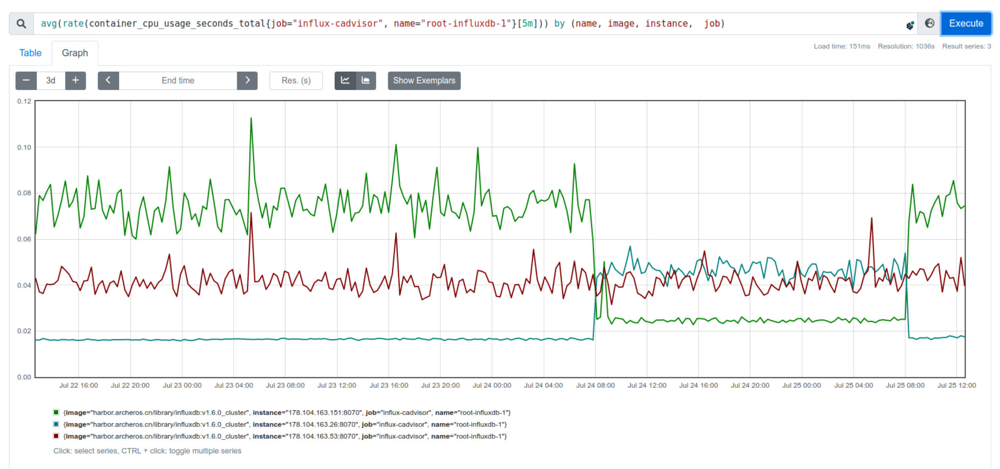
  
  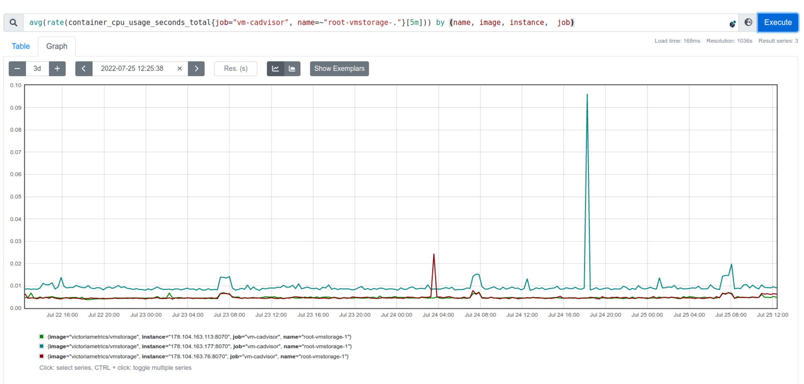

- Memory

  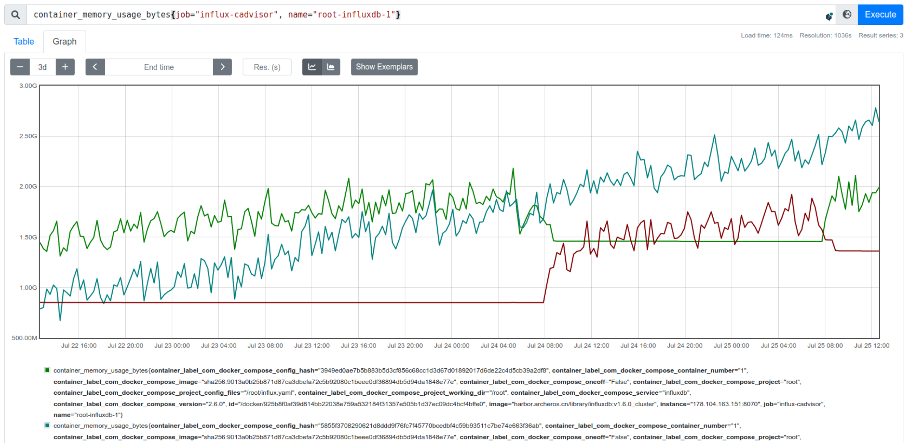

  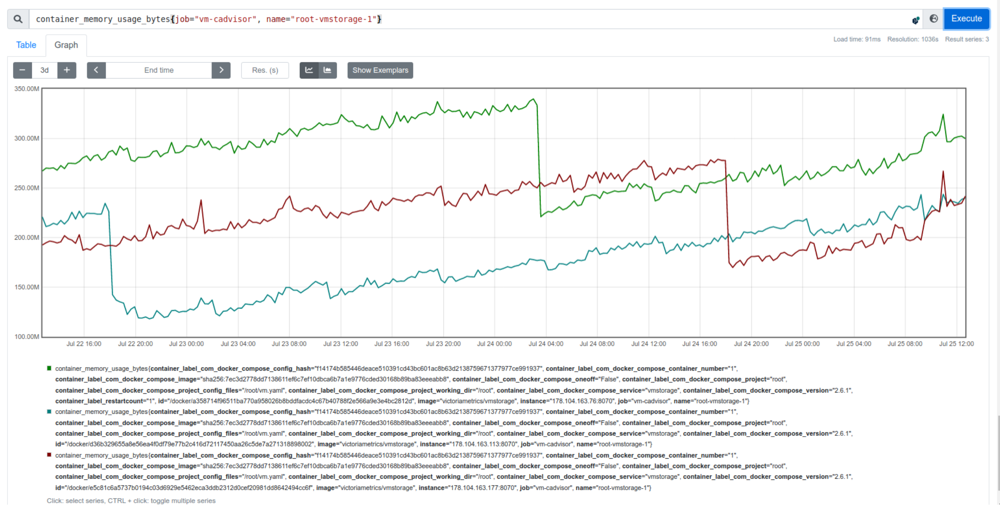

- Rss

  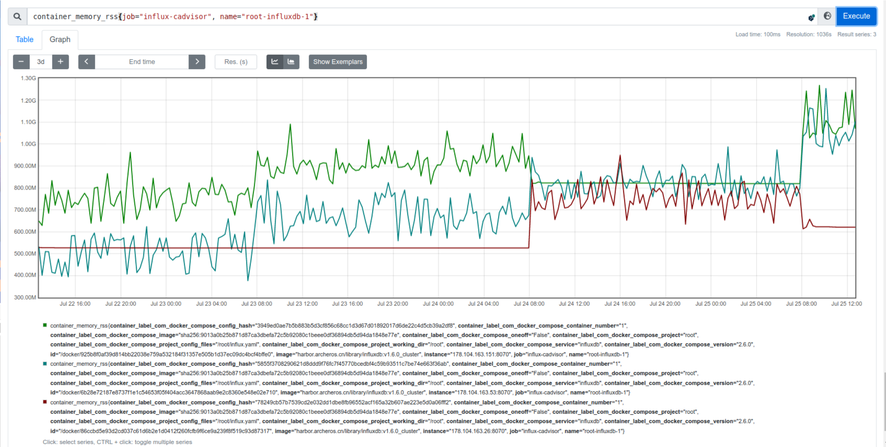

  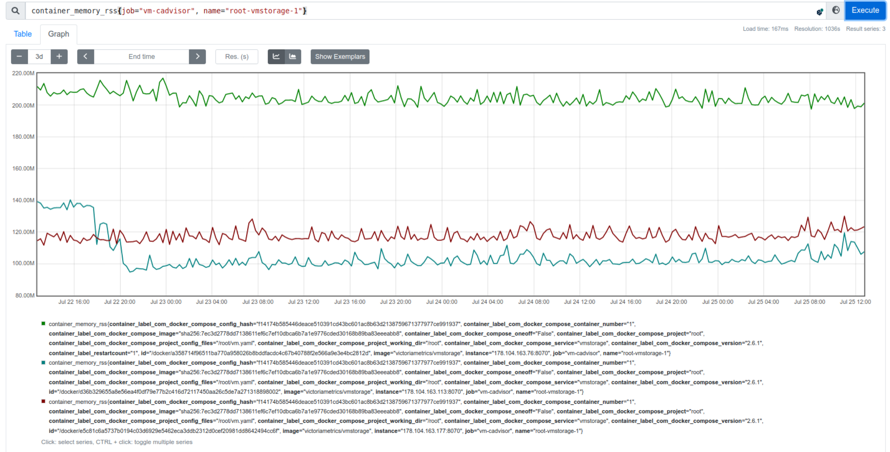

- Disk

  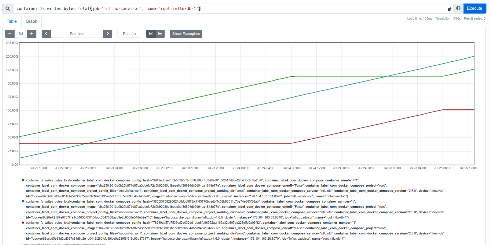

  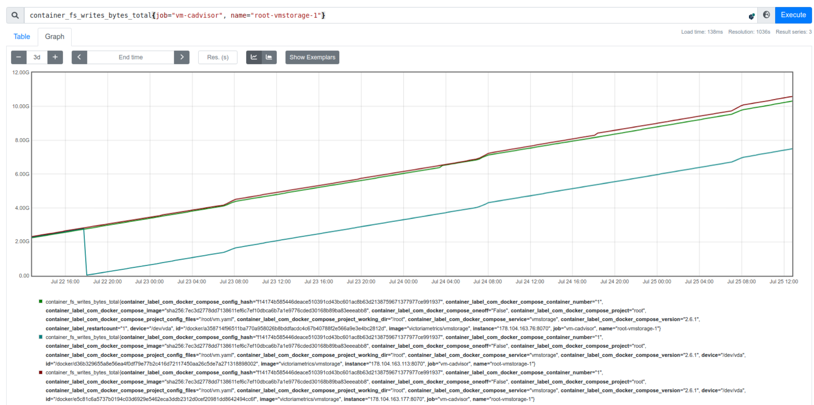

  ---

  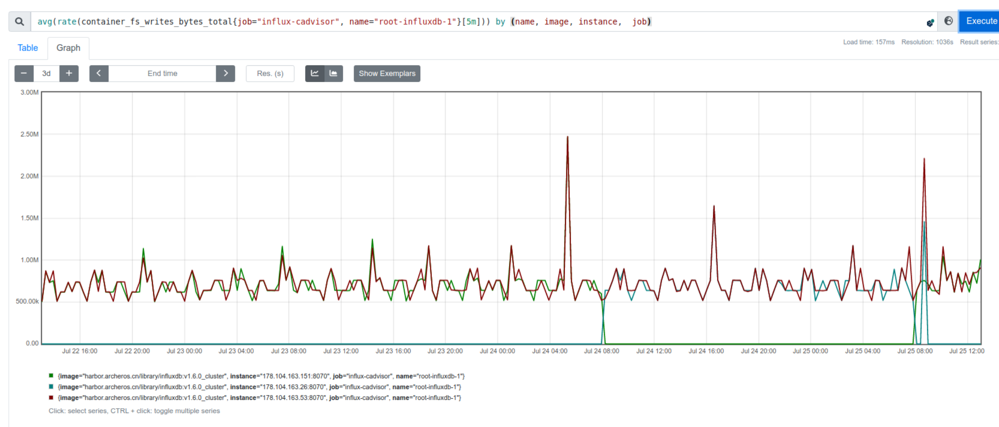

  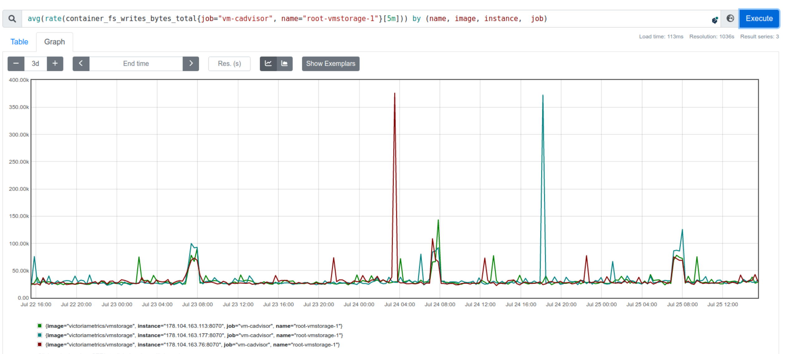
