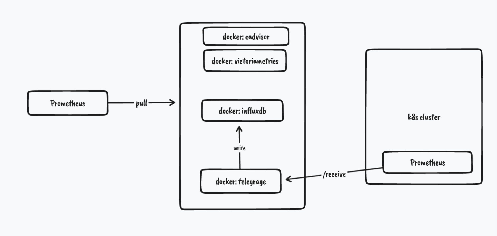
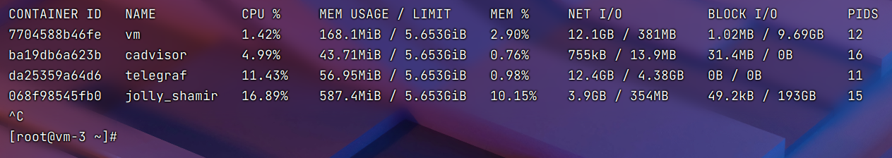
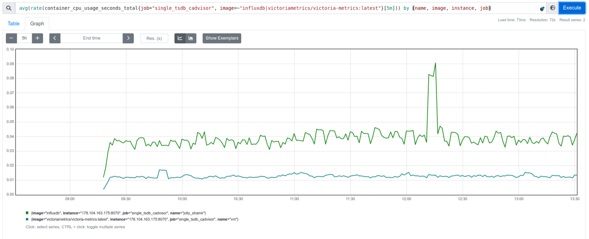
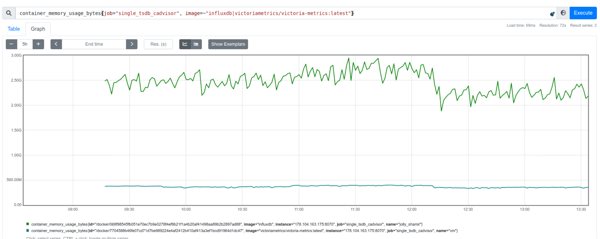
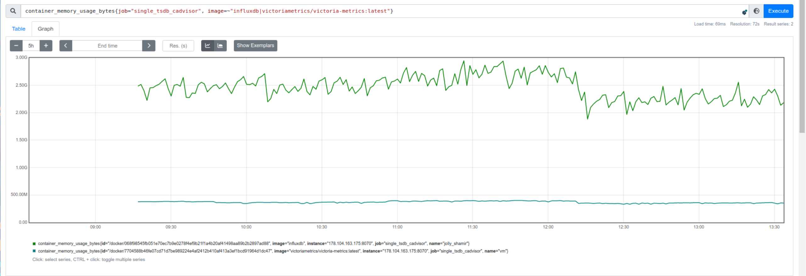
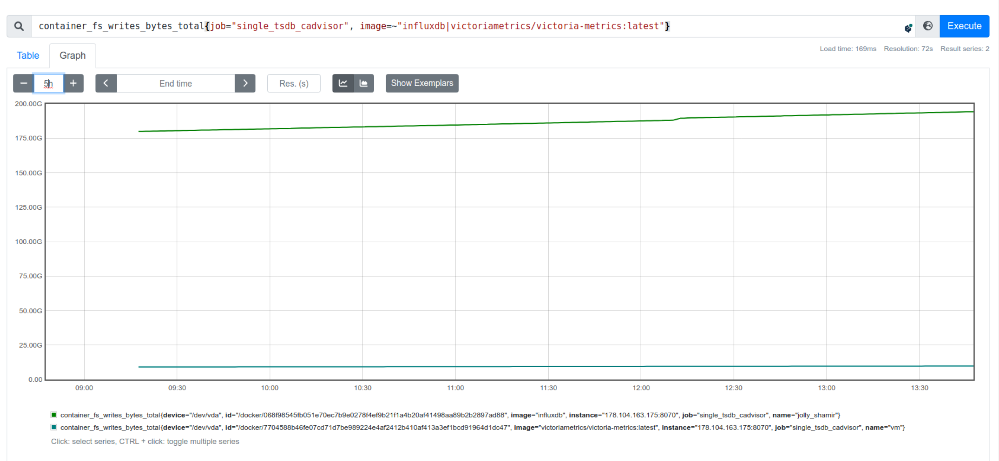
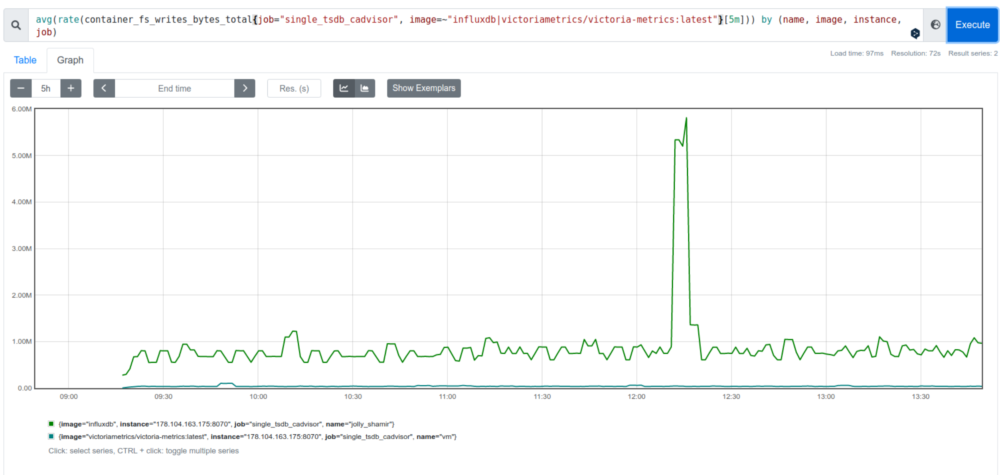

# influx_vs_victoriametrics_cluster_test_report

## 环境

- **Prometheus**: 178.104.163.111 2c4g

- **k8s集群**：178.104.163.88

- **Node**： 178.104.163.175	 2c6g


  > influxdb, victoriametrics 均安装最新版本作为本次测试


**架构图**



## 部署方式

[各组件部署方式](./single_version.md)

## 测试结果

> 运行时间两天

```sh
# 磁盘本地存储
[root@vm-3 ~]# du -sh vm
221M    vm
[root@vm-3 ~]# du -sh /var/lib/influxdb2/
1.6G    /var/lib/influxdb2/
```




- CPU

  

- Memory

  

- Rss

  

- Disk

  
  
  
