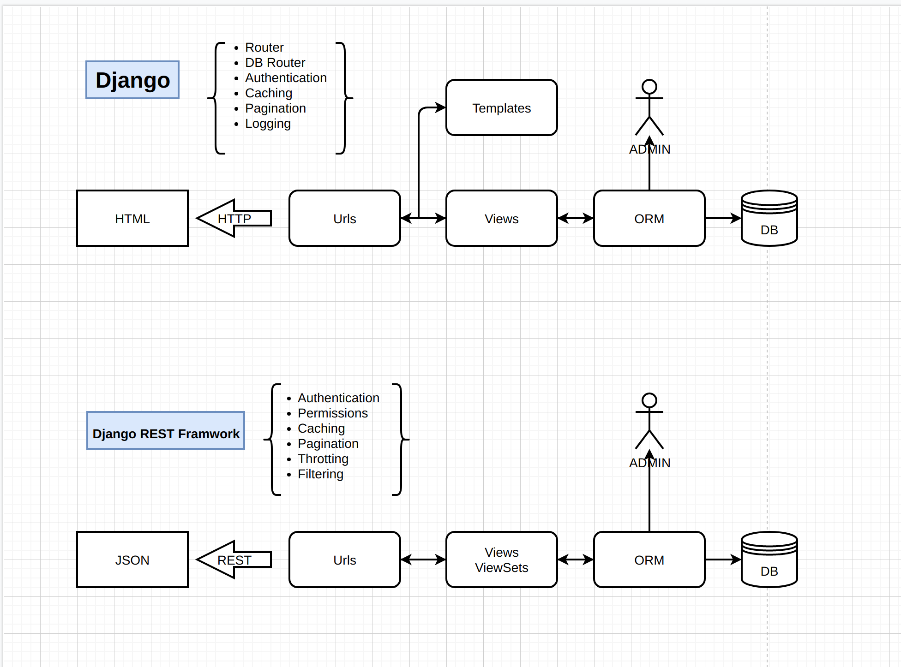

# 关于Django 和 DRF

这是Django的框图和Django REST Framwork的框图。




**最少的语言描述Django？**

将数据库的东西通过ORM的映射取出来，通过view文件，按照template文件排出的模板渲染成HTML。当用户请求相应的url时，返回相应的结果。

**最少语言描述DRF？**

将数据库的东西通过ORM的映射取出来，通过view和serializers文件绑定REST接口，当前端请求时，返回序列化好的json。

**最少语言描述DRF在Django的基础上做了什么？**

DRF是Django的超集，去掉了模板的部分，提供了一个REST的接口，同时也提供了满足该接口的代码工作流。同时，在REST的规范下，升级了权限和分页等功能，增加了限流和过滤搜索等功能。

**Django和DRF的tutorial分别讲了什么？**

Django的tutorial讲的是Django的ORM、template、url、admin以及Django怎么run起来等基础知识。

而DRF的tutorial讲的是serializers怎么写，view怎么写，在drf中view这一层既可以一个个get、post、从头开始写起，也可以采用抽象程度比较高的viewset去按配置生成。另外还讲了一些drf升级和新增的功能。

## **小结**

Django+DRF将后端变成一种声明式的工作流，只要按照models->serializers->views->urls的模式去一个个py文件去配置，即可生成一个很全面的通用的后端。


restful 规范

```tex
1、数据的安全保障
2、接口特征表现
3、多数据版本共存
4、数据及资源，均使用名词
5、资源操作由请求方式决定（method）
6、过滤，通过在url上传参的形式传递搜索条件
7、响应状态吗
8、错误处理，应返回错误信息，error当做key
9、返回结果，针对不同操作，服务器向用户返回的结果应该不同
10、需要url请求的资源显示访问资源的请求连接
```

