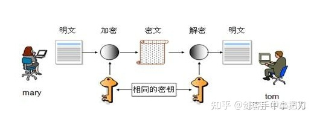
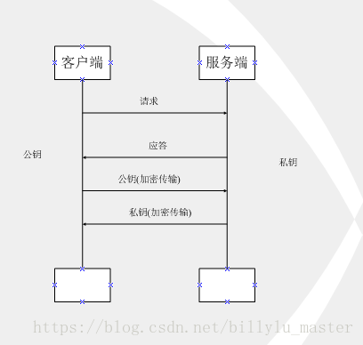
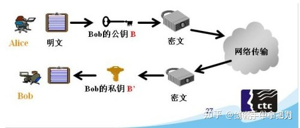
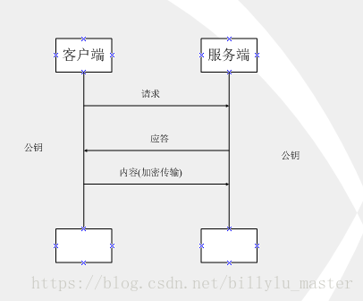
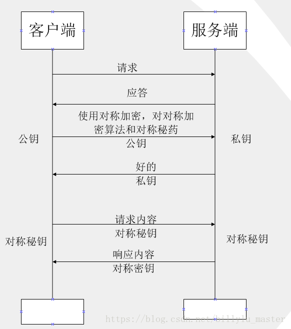

# 加密服务

> https://docs.python.org/zh-cn/3/library/crypto.html

#  [`hashlib`](https://docs.python.org/zh-cn/3/library/hashlib.html#module-hashlib) --- 安全哈希与消息摘要

## 哈希算法[¶](https://docs.python.org/zh-cn/3/library/hashlib.html#hash-algorithms)

每种类型的 *hash* 都有一个构造器方法。 它们都返回一个具有相同的简单接口的 hash 对象。 例如，使用 use `sha256()` 创建一个 SHA-256 hash 对象。 你可以使用 `update()` 方法向这个对象输入 [字节类对象](https://docs.python.org/zh-cn/3/glossary.html#term-bytes-like-object) (通常是 [`bytes`](https://docs.python.org/zh-cn/3/library/stdtypes.html#bytes))。 在任何时候你都可以使用 `digest()` 或 `hexdigest()` 方法获得到目前为止输入这个对象的拼接数据的 *digest*。


```python
import hashlib

m = hashlib.md5()

m.update('hello'.encode('utf8'))
print(m.hexdigest())
```


# [`secrets`](https://docs.python.org/zh-cn/3/library/secrets.html#module-secrets) --- 生成管理密码的安全随机数

[`secrets`](https://docs.python.org/zh-cn/3/library/secrets.html#module-secrets) 模块用于生成高度加密的随机数，适于管理密码、账户验证、安全凭据及机密数据。

最好用 [`secrets`](https://docs.python.org/zh-cn/3/library/secrets.html#module-secrets) 替代 [`random`](https://docs.python.org/zh-cn/3/library/random.html#module-random) 模块的默认伪随机数生成器，该生成器适用于建模和模拟，不宜用于安全与加密。

随机数[¶](https://docs.python.org/zh-cn/3/library/secrets.html#random-numbers)

[`secrets`](https://docs.python.org/zh-cn/3/library/secrets.html#module-secrets) 模块是操作系统提供的最安全地随机性来源。

- *class* `secrets.``SystemRandom`

  用操作系统提供的最高质量源生成随机数的类。详见 [`random.SystemRandom`](https://docs.python.org/zh-cn/3/library/random.html#random.SystemRandom)。

- `secrets.``choice`(*sequence*)

  返回从非空序列中随机选取的元素。

- `secrets.``randbelow`(*n*)

  返回 [0, *n*) 范围内的随机整数。

- `secrets.``randbits`(*k*)

  返回 *k* 个随机比特位的整数。

## 生成 Token

[`secrets`](https://docs.python.org/zh-cn/3/library/secrets.html#module-secrets) 模块提供了生成安全 Token 的函数，适用于密码重置、密保 URL 等应用场景。

- `secrets.``token_bytes`([*nbytes=None*])

- `secrets.``token_hex`([*nbytes=None*])[¶](https://docs.python.org/zh-cn/3/library/secrets.html#secrets.token_hex)

  返回十六进制随机文本字符串。字符串有 *nbytes* 个随机字节，每个字节转换为两个十六进制数码。未提供 *nbytes* 或为 `None` 时，则使用合理的默认值。` `

- `secrets.``token_urlsafe`([*nbytes=None*])

  返回安全的 URL 随机文本字符串，包含 *nbytes* 个随机字节。文本用 Base64 编码，平均来说，每个字节对应 1.3 个结果字符。未提供 *nbytes* 或为 `None` 时，则使用合理的默认值。

## 应用技巧与最佳实践[¶](https://docs.python.org/zh-cn/3/library/secrets.html#recipes-and-best-practices)

展示了一些使用 [`secrets`](https://docs.python.org/zh-cn/3/library/secrets.html#module-secrets) 管理基本安全级别的应用技巧和最佳实践。

生成长度为八个字符的字母数字密码：

```python
import string
import secrets
alphabet = string.ascii_letters + string.digits
password = ''.join(secrets.choice(alphabet) for i in range(8))
```

生成长度为十个字符的字母数字密码，包含至少一个小写字母，至少一个大写字母以及至少三个数字：

```python
import string
import secrets
alphabet = string.ascii_letters + string.digits
while True:
    password = ''.join(secrets.choice(alphabet) for i in range(10))
    if (any(c.islower() for c in password)
            and any(c.isupper() for c in password)
            and sum(c.isdigit() for c in password) >= 3):
        break
```

生成 [XKCD 风格的密码串](https://xkcd.com/936/)：

```python
import secrets
# On standard Linux systems, use a convenient dictionary file.
# Other platforms may need to provide their own word-list.
with open('/usr/share/dict/words') as f:
    words = [word.strip() for word in f]
    password = ' '.join(secrets.choice(words) for i in range(4))
```

生成临时密保 URL，包含密码恢复应用的安全 Token：

```python
import secrets
url = 'https://mydomain.com/reset=' + secrets.token_urlsafe()
```

# MD5及加密算法优劣

常用加密算法可以分为单向加密和双向加密。

- 单向加密：只提供单向加密不能解密，不可逆的过程。通常用来存储用户名和密码，直接从前端传输来存储到数据库中
- 双向加密：又分为对称性加密算法和非对称性加密算法。对称性加密算法，发送和接收端双方都知道秘钥和加密算法且秘钥都是相同的，之后便是对数据的加密和解密过程。非对称加密算法 ：发送之前A B事先生成一对秘钥，A将秘钥发送给B，B将秘钥发送给 A，A先用B的秘钥加密密文在发送B，B解密，同理。


# RSA

[安装](https://pycryptodome.readthedocs.io/en/latest/src/installation.html#)：

```python
# a library independent of the old PyCrypto. You install it with:

pip install pycryptodomex
# You can test everything is right with:

python -m Cryptodome.SelfTest
```

对比AES ：

| AES 对称加密   | 一种非公开的加密方式、速度快                                 |
| -------------- | ------------------------------------------------------------ |
| RSA 非对称加密 | 安全、目前无人破解、密钥分公钥和私钥、很少多大量数据进行加密、速度慢、一般用做对用户身份进行认证 |

> 使用场景：
>
> 非对称加密一般和对称加密结合使用，加密对称加密的密钥





如上图所示，此种方式属于对称加密，双方拥有相同的密钥，信息得到安全传输，但此种方式的缺点是：

（1）不同的客户端、服务器数量庞大，所以双方都需要维护大量的密钥，维护成本很高

（2）因每个客户端、服务器的安全级别不同，密钥极易泄露






 如上图所示，客户端用公钥对请求内容加密，服务器使用私钥对内容解密，反之亦然，但上述过程也存在缺点：

 公钥是公开的（也就是黑客也会有公钥），所以第 ④ 步私钥加密的信息，如果被黑客截获，其可以使用公钥进行解密，获取其中的内容。


RSA算法基于一个十分简单的数论事实，将两个大质数的相乘十分容易，但是想要将其的乘积进行因式分解却及其困难，因此将乘积作为公开加密密钥。

RSA的加密过程十分简单 (e, d, n 均为整数)：

| 公钥 | (n, e)              |
| ---- | ------------------- |
| 私钥 | (n, d)              |
| 加密 | 密文= (明文^ e) % n |
| 解密 | 明文= (密文^ d) % n |

密钥的生成步骤

1. 随机选取两个不相等的质数 p 和 q；

   61, 53，实际选取的数越大越好;

2. 计算 p 和 q的乘积 

   n  = 61 * 53 = 3233

   n 的长度是密钥的长度，实际应用RSA秘钥一般是1024位，重要的位3048位

3. 计算 n 的欧拉函数

   φ(n) = ( p - 1) * ( q - 1 ) = 60 * 52 = 3210

4. 随机选择一个整数 e ，条件是 1 < e < φ(n), 且 e 与 φ(n) 互质

   随机选了17， 实际应用中，常常选择 65537

5. 计算 e 对 φ(n)的模反元素 d

   所谓的模反元素就是指有一个整数 d，一是 e * d 被 φ(n)除，余数位1

   e * d -1 = k * φ(n)

   e * x + φ(n) * y = 1

   17x + 3120y = 1

   x = 2753

   y = -15

   d = 2753

6. 将 n 和 e 封装成公钥，n 和 d封装的是密钥

   100


> 欧拉函数：
>
> 就是对于一个正整数n，小于n且和n互质的正整数（包括1）的个数，记作φ(n) 。


### 加密与解密

通常通信的时候，发送者使用接受者的公钥加密，接受者使用接受者私钥解密。

简而言之，Master给Ghost通信，需要加密内容，那么Ghost会生成一个秘钥对，Ghost的公钥`ghost-public.pem`和私钥`ghost-private.pem` 。Ghost 把公钥公开给发送者，任何人都可以用来加密，然后Master使用`ghost-public.pem`进行加密，然后把内容发给Ghost，Ghost再使用`ghost-private.pem`进行解密。

```python
import binascii

from Cryptodome.PublicKey import RSA
from Cryptodome.Cipher import PKCS1_OAEP

def generate_key():
    """
    生成密钥对
    :return:
    """
    key = RSA.generate(1024)
    private_key = key.export_key()
    print(private_key)
    with open('prikey.pem', 'wb') as f:
        f.write(private_key)

    public_key = key.publickey().export_key()
    print(public_key)
    with open('pubkey.pem', 'wb') as f:
        f.write(public_key)

# generate_key()

def encrypt():
    """
    加密
    :return:
    """
    public_key = RSA.import_key(open('pubkey.pem', 'r').read())
    # print(public_key.e)
    # print(public_key.n)
    # print(len(str(public_key.n)))
    # print(public_key.d)
    data = '加密通话'.encode()
    cipher = PKCS1_OAEP.new(public_key)
    msg = cipher.encrypt(data)
    # print(msg)
    # print(binascii.b2a_hex(msg))
    return msg

# encrypt()

def decrypt():
    """
    解密
    :return:
    """
    private_key = RSA.import_key(open('prikey.pem').read())
    msg = encrypt()
    print(f'加密信息 {msg}')
    cipher = PKCS1_OAEP.new(private_key)
    res = cipher.decrypt(msg).decode('utf-8')
    return res


print(decrypt())
```


# AES

```python
# 加密 
from Crypto.Cipher import AES
from Crypto.Random import get_random_bytes

key = get_random_bytes(16)
# 16个字节的密码
key = b'1234567890123456'
print(key)
cipher = AES.new(key, AES.MODE_EAX)
data = '这是一段被加密的信息'.encode()
ciphertext, tag = cipher.encrypt_and_digest(data)
print(cipher.nonce, tag, ciphertext)
file_out = open("encrypted", "wb")
[ file_out.write(x) for x in (cipher.nonce, tag, ciphertext) ]
file_out.close()

# 解密
from Crypto.Cipher import AES

file_in = open("encrypted", "rb")
nonce, tag, ciphertext = [ file_in.read(x) for x in (16, 16, -1) ]
key = b'\xb7\xa0\x80j.\x9d|i\x93\x9es\xce3i\xb45'

key = b'1234567890123456'
nonce = b'\xf9\xac[\x03h\xf19m?\xbaH\x9e\x7f\xd1\xc3\x83'
tag = b'\x1f\xb0\xad\tw?\x1e\xc8\xe2dX\xb3@`Q\x8d'
ciphertext = b'\x8eS\xd6\x9c\x85\x0fC\xf7\rUQa>\xbc>\x86\xe1\xb5|\xe6\xab\x90]\xd8\x8f\x95\xa9w\n\xfa'
# let's assume that the key is somehow available again
cipher = AES.new(key, AES.MODE_EAX, nonce)
data = cipher.decrypt_and_verify(ciphertext, tag)
print(data.decode())
```


# 非对称加密的使用场景

在了解使用场景之前，先分析一下非对称加密。
公钥私钥本质上是一样的(也就是说两者可以互换)，之所以这么区分，就是因为一个公开了，另一个没公开，公开了就意味着有风险。

如果我们先用私钥加密一个信息，然后把信息发出去，让别人用我们之前公开或发送的公钥解密来获取信息，这是一种使用方法。相应的场景有签名(服务端加签、客户端解签验证)。像我们平时通过xshell直连服务器，一般是通过ssh协议，xshll生成一对公钥私钥，把私钥放在本地C:\Users\用户名.ssh目录下并导入shell，把公钥发送给服务器管理员，放在服务器中。这样我们连接服务器的时候，使用自己私钥加密，然后发给服务器使其用公钥解密，达到一个签名的效果。再比如git中也是支持https和ssh两种协议。
相反的一个场景就是加解密了，比如常见的https中，服务端先给客户端发送一个公钥，客户端通过公钥解密一些信息(比如客户端生成的会话秘钥)，发送给服务端，服务端通过自己的私钥解密，达到信息安全传输的目的。

# 对称加密的适用场景


对称加密是指，加密方和解密方使用同样的秘钥来进行加密和解密。

对称加密一般用在，我有一个秘钥，你也有这个秘钥，这个秘钥只有我们两个知道，所以可以用来传递一些隐秘的信息。
还是上面的https的流程，客户端和服务端拥有同一个会话秘钥，这样两者就可以通过这个秘钥加密会话，进行安全传输。
至于这个秘钥怎么来的，就是通过上面非对称加密的加解密场景。

------------------------------------------------
# **非对称和对称完美结合**

非对称加密既然也有缺陷，那我们就将对称加密，非对称加密两者结合起来，取其精华、去其糟粕，发挥两者的各自的优势：




# 对称与非对称秘钥混合使用保证数据安全
甲想给乙发送加密数据，首先甲给乙发送消息说明它要使用混合加密方式发送数据，此时乙会生成一个公钥和一个私钥并把公钥发给甲，甲使用乙发过来的公钥对对称秘钥进行加密发过去，再把用对称秘钥加密的数据发送给乙，乙使用自己的私钥对甲发过来的经过加密的对称秘钥进行解密，然后通过对称秘钥对原始数据进行解密。
