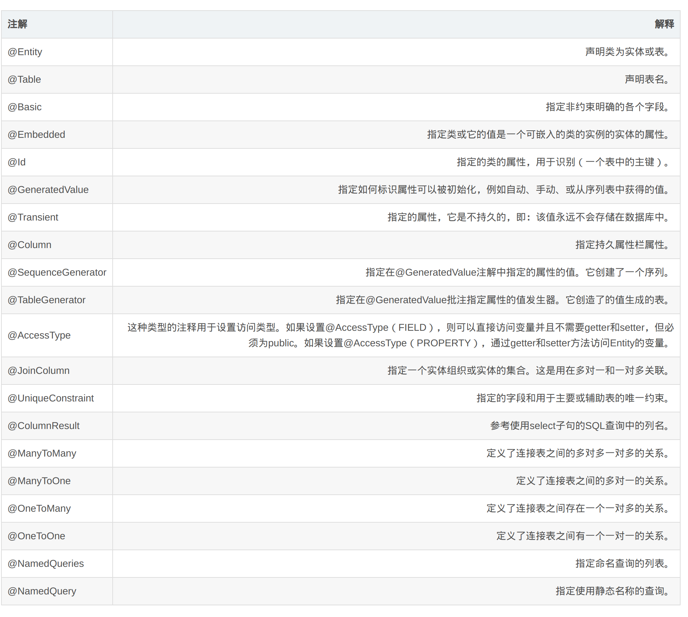
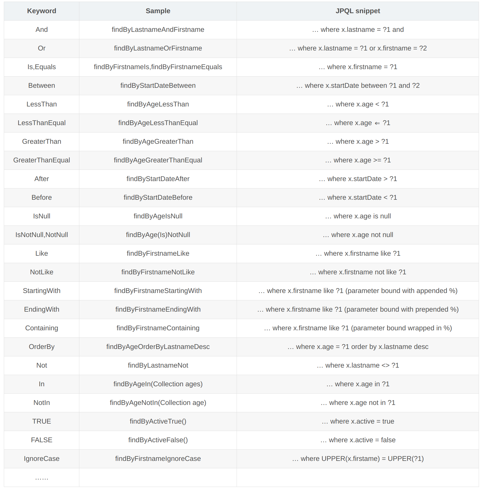

# 一、SpringBootData JPA介绍

  SpringData：其实SpringData就是Spring提供了一个操作数据的框架。而SpringData JPA只是SpringData框架下的一个基于JPA标准操作数据的模块。
  SpringData JPA：基于JPA的标准数据进行操作。简化操作持久层的代码。只需要编写接口就可以。




JPA在这里遵循Convention over configuration（约定大约配置）的原则，遵循spring 以及JPQL定义的方法命名。Spring提供了一套可以通过命名规则进行查询构建的机制。这套机制会把方法名首先过滤一些关键字，比如 find…By, read…By, query…By, count…By 和 get…By 。系统会根据关键字将命名解析成2个子语句，第一个 By 是区分这两个子语句的关键词。这个 By 之前的子语句是查询子语句（指明返回要查询的对象），后面的部分是条件子语句。如果直接就是 findBy… 返回的就是定义Respository时指定的领域对象集合，同时JPQL中也定义了丰富的关键字：and、or、Between等等，下面我们来看一下JPQL中有哪些关键字：
------------------------------------------------



# 二、SpringBoot整合SpringData JPA

## 1、导入maven依赖

 在原有的SprigBoot的maven依赖的基础下加上JPA的依赖

```xml
        <dependency>
            <groupId>org.springframework.boot</groupId>
            <artifactId>spring-boot-starter-data-jpa</artifactId>
        </dependency>
```

## 2、application.properties文件中添加配置

```properties
spring.datasource.url=jdbc:postgresql://192.168.2.203:5432/cubex
spring.datasource.username=cubex
spring.datasource.password=gcbi123
spring.datasource.driver-class-name=org.postgresql.Driver

#spring JPA setting
spring.jpa.database=postgresql
spring.jpa.show-sql=true
# jpa 的正向工程
#spring.jpa.hibernate.ddl-auto=none
spring.jpa.hibernate.ddl-auto=update
#spring.jpa.hibernate.ddl-auto=create-drop
# spring.datasource.initialization-mode=always
# spring.datasource.initialization-mode=never
spring.jpa.properties.hibernate.dialect=org.hibernate.dialect.PostgreSQL9Dialect
spring.jpa.properties.hibernate.temp.use_jdbc_metadata_defaults=false

```

```xml
jpa.hibernate.ddl-auto是hibernate的配置属性，其主要作用是：自动创建、更新、验证数据库表结构。该参数的几种配置如下：
    ·create：每次加载hibernate时都会删除上一次的生成的表，然后根据你的model类再重新来生成新表，哪怕两次没有任何改变也要这样执行，这就是导致数据库表数据丢失的一个重要原因。
    ·create-drop：每次加载hibernate时根据model类生成表，但是sessionFactory一关闭,表就自动删除。
    ·update：最常用的属性，第一次加载hibernate时根据model类会自动建立起表的结构（前提是先建立好数据库），以后加载hibernate时根据model类自动更新表结构，即使表结构改变了但表中的行仍然存在不会删除以前的行。要注意的是当部署到服务器后，表结构是不会被马上建立起来的，是要等应用第一次运行起来后才会。
    ·validate：每次加载hibernate时，验证创建数据库表结构，只会和数据库中的表进行比较，不会创建新表，但是会插入新值。

```


## 3、实体类

```java
@Data
@Entity
@Table(name="t_users")
public class Users {
    @Id    //主键id
    @GeneratedValue(strategy= GenerationType.IDENTITY)//主键生成策略
    @Column(name="id")//数据库字段名
    private Integer id;

    @Column(name="name")
    private String name;

    @Column(name="age")
    private Integer age;

    @Column(name="address")
    private String address;
    
}
```

## 4、编写Dao接口

接口只需要继承`JpaRepository`接口即可

```java
public interface UserJpaRepository extends JpaRepository<Users, Integer> {


    //方法名称必须要遵循驼峰式命名规则，findBy（关键字）+属性名称（首字母大写）+查询条件（首字母大写）
    List<Users> findByName(String name);

    List<Users> findByNameAndAge(String name,Integer age);

    List<Users> findByNameLike(String name);

    //    基于@Query注解查询与更新

    @Query("from Users where name=?1")
    List<Users> queryByNameUseHQL(String name);

    @Query(value = "select * from t_users where name=?1",nativeQuery = true)
    List<Users> queryByNameUseSQL(String name);

    @Query("update Users set name=?1 where id=?2")
    @Modifying//需要执行一个更新操作
    void updateUsersNameById(String name,Integer id);
}

```

## 5.测试

```java
@Test
    void contextLoads() {
        Users users = new Users();
        users.setAddress("上市");
        users.setAge(13);
        users.setName("小黑");
        userJpaRepository.save(users);
//        usersRepository.
    }
    /**
     * Repository
     */
    @Test
    public void UsersRepositoryByName(){
        List<Users> list=usersRepository.findByName("小黑");
        for (Users users:list){
            System.out.println(users);
        }
    }
    @Test
    public void findByNameAndAge(){
        List<Users> list=userJpaRepository.findByNameAndAge("小黑",13);
        for (Users users:list){
            System.out.println(users);
        }
    }
    @Test
    public void findByNameLike() {
        List<Users> list = usersRepository.findByNameLike("小%");
        for (Users users : list) {
            System.out.println(users);
        }
    }
    /**
     * Repository--@Query测试
     */
    @Test
    public void testQueryByNameUseSQL() {
        List<Users> list = userJpaRepository.queryByNameUseSQL("小黑");
        for (Users users : list) {
            System.out.println(users);
        }
    }
    /**
     * Repository--@Query测试
     */
    @Test
    @Transactional //@Transactional与@Test 一起使用时 事务是自动回滚的。
    @Rollback(false) //取消自动回滚
    public void testUpdateUsersNameById() {
        userJpaRepository.updateUsersNameById("小黑黑", 1);
    }
```

