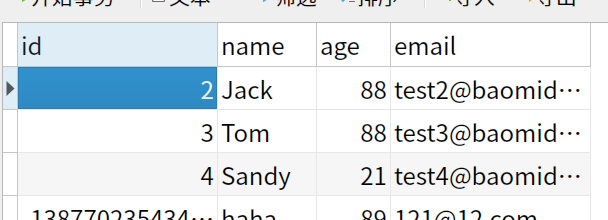
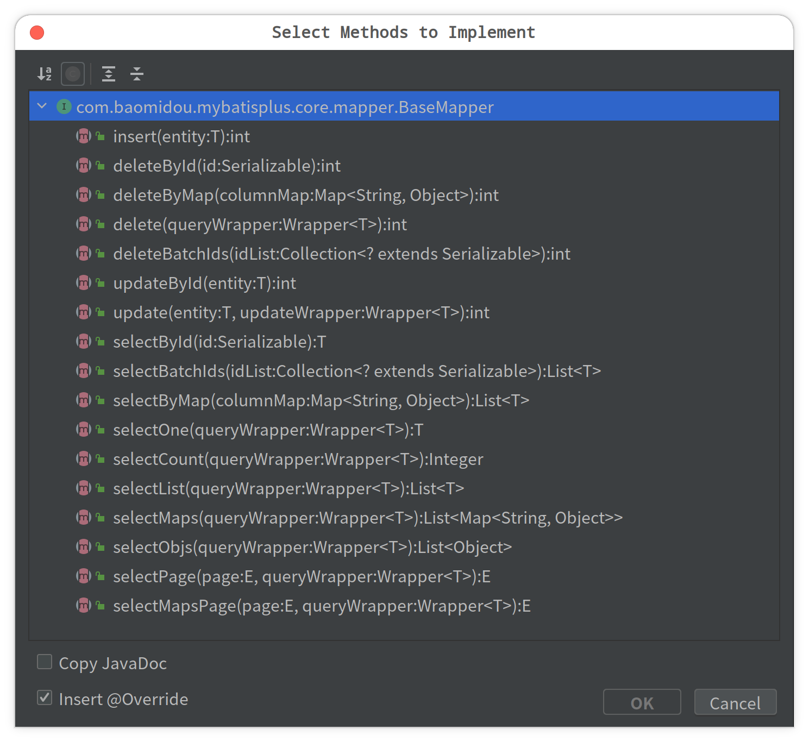
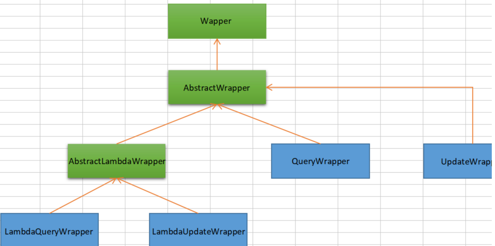
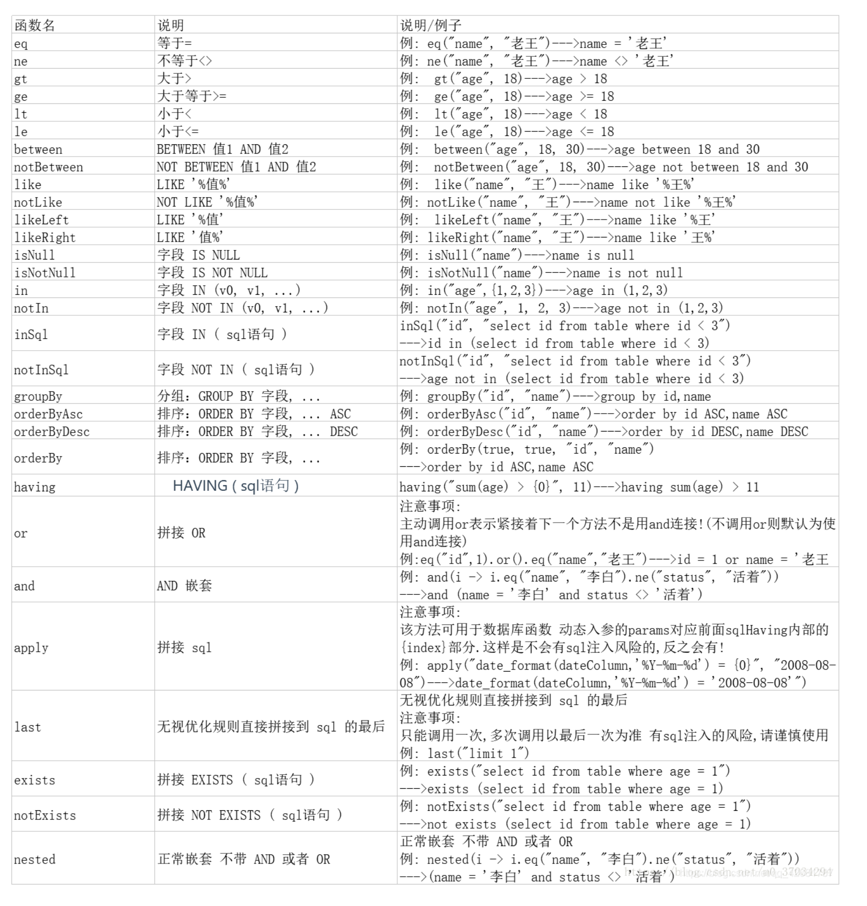
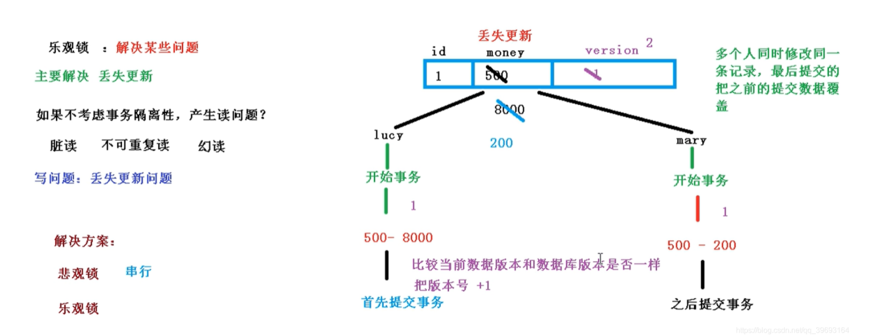

# MyBatis-Plus

>  为简化开发而生


###  当前版本

```xml
<dependency>
    <groupId>com.baomidou</groupId>
    <artifactId>mybatis-plus</artifactId>
    <version>3.4.2</version>
</dependency>
```

#  简介

[MyBatis-Plus ](https://github.com/baomidou/mybatis-plus)（简称 MP）是一个 [MyBatis](http://www.mybatis.org/mybatis-3/)的增强工具，在 MyBatis 的基础上只做增强不做改变，为简化开发、提高效率而生。

## 特性

- **无侵入**：只做增强不做改变，引入它不会对现有工程产生影响，如丝般顺滑

- **损耗小**：启动即会自动注入基本 CURD，性能基本无损耗，直接面向对象操作

- **强大的 CRUD 操作**：内置通用 Mapper、通用 Service，仅仅通过少量配置即可实现单表大部分 CRUD 操作，更有强大的条件构造器，满足各类使用需求

- **支持 Lambda 形式调用**：通过 Lambda 表达式，方便的编写各类查询条件，无需再担心字段写错

- **支持主键自动生成**：支持多达 4 种主键策略（内含分布式唯一 ID 生成器 - Sequence），可自由配置，完美解决主键问题

- **支持 ActiveRecord 模式**：支持 ActiveRecord 形式调用，实体类只需继承 Model 类即可进行强大的 CRUD 操作

- **支持自定义全局通用操作**：支持全局通用方法注入（ Write once, use anywhere ）

- **内置代码生成器**：采用代码或者 Maven 插件可快速生成 Mapper 、 Model 、 Service 、 Controller 层代码，支持模板引擎，更有超多自定义配置等您来使用

- **内置分页插件**：基于 MyBatis 物理分页，开发者无需关心具体操作，配置好插件之后，写分页等同于普通 List 查询

- **分页插件支持多种数据库**：支持 MySQL、MariaDB、Oracle、DB2、H2、HSQL、SQLite、Postgre、SQLServer 等多种数据库

- **内置性能分析插件**：可输出 Sql 语句以及其执行时间，建议开发测试时启用该功能，能快速揪出慢查询

- **内置全局拦截插件**：提供全表 delete 、 update 操作智能分析阻断，也可自定义拦截规则，预防误操作

  

## 支持数据库

> 任何能使用 `mybatis` 进行 crud, 并且支持标准 sql 的数据库


## 框架结构


# 快速开始

现有一张 `User` 表，其表结构如下：

| id   | name   | age  | email              |
| ---- | ------ | ---- | ------------------ |
| 1    | Jone   | 18   | test1@baomidou.com |
| 2    | Jack   | 20   | test2@baomidou.com |
| 3    | Tom    | 28   | test3@baomidou.com |
| 4    | Sandy  | 21   | test4@baomidou.com |
| 5    | Billie | 24   | test5@baomidou.com |

其对应的数据库 Schema 脚本如下：

```sql
DROP TABLE IF EXISTS user;

CREATE TABLE user
(
	id BIGINT(20) NOT NULL COMMENT '主键ID',
	name VARCHAR(30) NULL DEFAULT NULL COMMENT '姓名',
	age INT(11) NULL DEFAULT NULL COMMENT '年龄',
	email VARCHAR(50) NULL DEFAULT NULL COMMENT '邮箱',
	PRIMARY KEY (id)
);
```

其对应的数据库 Data 脚本如下：

```sql
DELETE FROM user;

INSERT INTO user (id, name, age, email) VALUES
(1, 'Jone', 18, 'test1@baomidou.com'),
(2, 'Jack', 20, 'test2@baomidou.com'),
(3, 'Tom', 28, 'test3@baomidou.com'),
(4, 'Sandy', 21, 'test4@baomidou.com'),
(5, 'Billie', 24, 'test5@baomidou.com');
```



## 添加依赖

```xml
<dependencies>
    <dependency>
        <groupId>org.springframework.boot</groupId>
        <artifactId>spring-boot-starter</artifactId>
    </dependency>
    <dependency>
        <groupId>org.springframework.boot</groupId>
        <artifactId>spring-boot-starter-test</artifactId>
        <scope>test</scope>
    </dependency>
    <dependency>
        <groupId>com.baomidou</groupId>
        <artifactId>mybatis-plus-boot-starter</artifactId>
        <version>3.4.2</version>
    </dependency>
    <dependency>
        <groupId>mysql</groupId>
        <artifactId>mysql-connector-java</artifactId>
        <version>8.0.22</version>
    </dependency>
</dependencies>
```

## 配置

在 `application.yml` 配置文件中添加 mysql 数据库的相关配置：

```yaml
# DataSource Config
spring:
  datasource:
    url: jdbc:mysql://0.0.0.0:3306/test
    username: root
    password: 123456
    username: root
    password: test
```

在 Spring Boot 启动类中添加 `@MapperScan` 注解，扫描 Mapper 文件夹：

```java
@SpringBootApplication
@MapperScan("com.xxml.admin.mapper")
public class Application {
    public static void main(String[] args) {
        SpringApplication.run(QuickStartApplication.class, args);
    }

}
```


## 基于mybatis-plus的入门helloworld---CRUD实验

>  ps:在进行crud实验之前,简单对mybatis与mybatis-plus做一个简单的对比

- ##### mybatis与mybatis-plus实现方式对比

(1)提出问题: 假设我们已存在一张 user 表,且已有对应的实体类 User,实现 user 表的 CRUD
操作我们需要做什么呢?
(2)实现方式: 基于 Mybatis 需要编写 UserMapper 接口,并手动编写 CRUD 方法 提供 UserMapper.xml 映
射文件,并手动编写每个方法对应的 SQL 语句. 基于 Mybatis-plus 只需要创建 UserMapper 接口, 并继承
BaseMapper 接口.这就是使用 mybatis-plus 需要完成的所有操作,甚至不需要创建 SQL 映射文件。

- ##### BaseMapper接口介绍

###### (1)如何理解核心接口BaseMapper?

在使用Mybatis-Plus是,核心操作类是BaseMapper接口,其最终也是利用的Mybatis接口编程的实现机制,其默认提供
了一系列的增删改查的基础方法,并且开发人员对于这些基础操作不需要写SQL进行处理操作(Mybatis提供的机制就是
需要开发人员在mapper.xml中提供sql语句),那样我们可以猜测肯定是Mybatis-Plus完成了BaseMapper接口提供的
方法的SQL语句的生成操作。

###### (2)BaseMapper 接口定义的方法



- ###### mybatis-plus中常用的注解

```java
@TableName:对数据表名注解
@TableId:表主键标识
@TableId(value = "id", type = IdType.AUTO):自增
@TableId(value = "id", type = IdType.ID_WORKER_STR):分布式全局唯一ID字符串类型
@TableId(value = "id", type = IdType.INPUT):自行输入
@TableId(value = "id", type = IdType.ID_WORKER):分布式全局唯一ID 长整型类型
@TableId(value = "id", type = IdType.UUID):32位UUID字符串
@TableId(value = "id", type = IdType.NONE):无状态
@TableField:表字段标识
@TableField(exist = false):表示该属性不为数据库表字段,但又是必须使用的。
@TableField(exist = true):表示该属性为数据库表字段。
@TableField(condition = SqlCondition.LIKE):表示该属性可以模糊搜索。
@TableField(fill = FieldFill.INSERT):注解填充字段 ,生成器策略部分也可以配置!
@FieldStrategy:
@FieldFill
@Version:乐观锁注解、标记
@EnumValue:通枚举类注解
@TableLogic:表字段逻辑处理注解(逻辑删除)
@SqlParser:租户注解
@KeySequence:序列主键策略
```

常用的就三个:@TableName @TableId @TableField
查看更多注解以及详解,请移步至官网:
https://mybatis.plus/guide/annotation.html

## 编码

###### 创建 java bean

编写实体类 `User.java`（此处使用了 [Lombok ](https://www.projectlombok.org/)简化代码）

```java
@Data
@TableName("user")
public class User {
     /**
     * mybatisPlus 会默认将 bean 类当成表名，如果表名和类名不一致，可以使用注解
     * 所有属性都应该在数据库中
     */
    private Long id;
    private String name;
    private Integer age;
    private String email;
}
```

编写Mapper类 `UserMapper.java`

```java
public interface UserMapper extends BaseMapper<User> {

}
```

添加测试类，进行功能测试：

```java
@RunWith(SpringRunner.class)
@SpringBootTest
public class SampleTest {

    @Autowired
    private UserMapper userMapper;

    @Test
    public void testSelect() {
        System.out.println(("----- selectAll method test ------"));
        List<User> userList = userMapper.selectList(null);
        Assert.assertEquals(5, userList.size());
        userList.forEach(System.out::println);
    }

}
```


# 开始使用 CRUD 接口


## Service CRUD 接口

说明:

- 通用 Service CRUD 封装[IService (opens new window)](https://gitee.com/baomidou/mybatis-plus/blob/3.0/mybatis-plus-extension/src/main/java/com/baomidou/mybatisplus/extension/service/IService.java)接口，进一步封装 CRUD 采用 `get 查询单行` `remove 删除` `list 查询集合` `page 分页` 前缀命名方式区分 `Mapper` 层避免混淆，
- 泛型 `T` 为任意实体对象
- 建议如果存在自定义通用 Service 方法的可能，请创建自己的 `IBaseService` 继承 `Mybatis-Plus` 提供的基类
- 对象 `Wrapper` 为 [条件构造器](https://baomidou.com/guide/wrapper.html)

### [#](https://baomidou.com/guide/crud-interface.html#save)Save

```java
// 插入一条记录（选择字段，策略插入）
boolean save(T entity);
// 插入（批量）
boolean saveBatch(Collection<T> entityList);
// 插入（批量）
boolean saveBatch(Collection<T> entityList, int batchSize);
```

##### [#](https://baomidou.com/guide/crud-interface.html#参数说明)参数说明

|     类型      |   参数名   |     描述     |
| :-----------: | :--------: | :----------: |
|       T       |   entity   |   实体对象   |
| Collection<T> | entityList | 实体对象集合 |
|      int      | batchSize  | 插入批次数量 |

### [#](https://baomidou.com/guide/crud-interface.html#saveorupdate)SaveOrUpdate

```java
// TableId 注解存在更新记录，否插入一条记录
boolean saveOrUpdate(T entity);
// 根据updateWrapper尝试更新，否继续执行saveOrUpdate(T)方法
boolean saveOrUpdate(T entity, Wrapper<T> updateWrapper);
// 批量修改插入
boolean saveOrUpdateBatch(Collection<T> entityList);
// 批量修改插入
boolean saveOrUpdateBatch(Collection<T> entityList, int batchSize);
```

##### [#](https://baomidou.com/guide/crud-interface.html#参数说明-2)参数说明

|     类型      |    参数名     |               描述               |
| :-----------: | :-----------: | :------------------------------: |
|       T       |    entity     |             实体对象             |
|  Wrapper<T>   | updateWrapper | 实体对象封装操作类 UpdateWrapper |
| Collection<T> |  entityList   |           实体对象集合           |
|      int      |   batchSize   |           插入批次数量           |

### [#](https://baomidou.com/guide/crud-interface.html#remove)Remove

```java
// 根据 entity 条件，删除记录
boolean remove(Wrapper<T> queryWrapper);
// 根据 ID 删除
boolean removeById(Serializable id);
// 根据 columnMap 条件，删除记录
boolean removeByMap(Map<String, Object> columnMap);
// 删除（根据ID 批量删除）
boolean removeByIds(Collection<? extends Serializable> idList);
```

##### [#](https://baomidou.com/guide/crud-interface.html#参数说明-3)参数说明

|                类型                |    参数名    |          描述           |
| :--------------------------------: | :----------: | :---------------------: |
|             Wrapper<T>             | queryWrapper | 实体包装类 QueryWrapper |
|            Serializable            |      id      |         主键ID          |
|        Map<String, Object>         |  columnMap   |     表字段 map 对象     |
| Collection<? extends Serializable> |    idList    |       主键ID列表        |

### [#](https://baomidou.com/guide/crud-interface.html#update)Update

```java
// 根据 UpdateWrapper 条件，更新记录 需要设置sqlset
boolean update(Wrapper<T> updateWrapper);
// 根据 whereWrapper 条件，更新记录
boolean update(T updateEntity, Wrapper<T> whereWrapper);
// 根据 ID 选择修改
boolean updateById(T entity);
// 根据ID 批量更新
boolean updateBatchById(Collection<T> entityList);
// 根据ID 批量更新
boolean updateBatchById(Collection<T> entityList, int batchSize);
```

##### [#](https://baomidou.com/guide/crud-interface.html#参数说明-4)参数说明

|     类型      |    参数名     |               描述               |
| :-----------: | :-----------: | :------------------------------: |
|  Wrapper<T>   | updateWrapper | 实体对象封装操作类 UpdateWrapper |
|       T       |    entity     |             实体对象             |
| Collection<T> |  entityList   |           实体对象集合           |
|      int      |   batchSize   |           更新批次数量           |

### [#](https://baomidou.com/guide/crud-interface.html#get)Get

```java
// 根据 ID 查询
T getById(Serializable id);
// 根据 Wrapper，查询一条记录。结果集，如果是多个会抛出异常，随机取一条加上限制条件 wrapper.last("LIMIT 1")
T getOne(Wrapper<T> queryWrapper);
// 根据 Wrapper，查询一条记录
T getOne(Wrapper<T> queryWrapper, boolean throwEx);
// 根据 Wrapper，查询一条记录
Map<String, Object> getMap(Wrapper<T> queryWrapper);
// 根据 Wrapper，查询一条记录
<V> V getObj(Wrapper<T> queryWrapper, Function<? super Object, V> mapper);
```

##### [#](https://baomidou.com/guide/crud-interface.html#参数说明-5)参数说明

|            类型             |    参数名    |              描述               |
| :-------------------------: | :----------: | :-----------------------------: |
|        Serializable         |      id      |             主键ID              |
|         Wrapper<T>          | queryWrapper | 实体对象封装操作类 QueryWrapper |
|           boolean           |   throwEx    |   有多个 result 是否抛出异常    |
|              T              |    entity    |            实体对象             |
| Function<? super Object, V> |    mapper    |            转换函数             |

### [#](https://baomidou.com/guide/crud-interface.html#list)List

```java
// 查询所有
List<T> list();
// 查询列表
List<T> list(Wrapper<T> queryWrapper);
// 查询（根据ID 批量查询）
Collection<T> listByIds(Collection<? extends Serializable> idList);
// 查询（根据 columnMap 条件）
Collection<T> listByMap(Map<String, Object> columnMap);
// 查询所有列表
List<Map<String, Object>> listMaps();
// 查询列表
List<Map<String, Object>> listMaps(Wrapper<T> queryWrapper);
// 查询全部记录
List<Object> listObjs();
// 查询全部记录
<V> List<V> listObjs(Function<? super Object, V> mapper);
// 根据 Wrapper 条件，查询全部记录
List<Object> listObjs(Wrapper<T> queryWrapper);
// 根据 Wrapper 条件，查询全部记录
<V> List<V> listObjs(Wrapper<T> queryWrapper, Function<? super Object, V> mapper);
```

##### [#](https://baomidou.com/guide/crud-interface.html#参数说明-6)参数说明

|                类型                |    参数名    |              描述               |
| :--------------------------------: | :----------: | :-----------------------------: |
|             Wrapper<T>             | queryWrapper | 实体对象封装操作类 QueryWrapper |
| Collection<? extends Serializable> |    idList    |           主键ID列表            |
|        Map<?String, Object>        |  columnMap   |         表字段 map 对象         |
|    Function<? super Object, V>     |    mapper    |            转换函数             |

### [#](https://baomidou.com/guide/crud-interface.html#page)Page

```java
// 无条件分页查询
IPage<T> page(IPage<T> page);
// 条件分页查询
IPage<T> page(IPage<T> page, Wrapper<T> queryWrapper);
// 无条件分页查询
IPage<Map<String, Object>> pageMaps(IPage<T> page);
// 条件分页查询
IPage<Map<String, Object>> pageMaps(IPage<T> page, Wrapper<T> queryWrapper);
```

##### [#](https://baomidou.com/guide/crud-interface.html#参数说明-7)参数说明

|    类型    |    参数名    |              描述               |
| :--------: | :----------: | :-----------------------------: |
|  IPage<T>  |     page     |            翻页对象             |
| Wrapper<T> | queryWrapper | 实体对象封装操作类 QueryWrapper |

### [#](https://baomidou.com/guide/crud-interface.html#count)Count

```java
// 查询总记录数
int count();
// 根据 Wrapper 条件，查询总记录数
int count(Wrapper<T> queryWrapper);
```

##### [#](https://baomidou.com/guide/crud-interface.html#参数说明-8)参数说明

|    类型    |    参数名    |              描述               |
| :--------: | :----------: | :-----------------------------: |
| Wrapper<T> | queryWrapper | 实体对象封装操作类 QueryWrapper |

### [#](https://baomidou.com/guide/crud-interface.html#chain)Chain

#### [#](https://baomidou.com/guide/crud-interface.html#query)query

```java
// 链式查询 普通
QueryChainWrapper<T> query();
// 链式查询 lambda 式。注意：不支持 Kotlin
LambdaQueryChainWrapper<T> lambdaQuery(); 

// 示例：
query().eq("column", value).one();
lambdaQuery().eq(Entity::getId, value).list();
```

#### [#](https://baomidou.com/guide/crud-interface.html#update-2)update

```java
// 链式更改 普通
UpdateChainWrapper<T> update();
// 链式更改 lambda 式。注意：不支持 Kotlin 
LambdaUpdateChainWrapper<T> lambdaUpdate();

// 示例：
update().eq("column", value).remove();
lambdaUpdate().eq(Entity::getId, value).update(entity);
```

## [#](https://baomidou.com/guide/crud-interface.html#mapper-crud-接口)Mapper CRUD 接口

说明:

- 通用 CRUD 封装[BaseMapper (opens new window)](https://gitee.com/baomidou/mybatis-plus/blob/3.0/mybatis-plus-core/src/main/java/com/baomidou/mybatisplus/core/mapper/BaseMapper.java)接口，为 `Mybatis-Plus` 启动时自动解析实体表关系映射转换为 `Mybatis` 内部对象注入容器
- 泛型 `T` 为任意实体对象
- 参数 `Serializable` 为任意类型主键 `Mybatis-Plus` 不推荐使用复合主键约定每一张表都有自己的唯一 `id` 主键
- 对象 `Wrapper` 为 [条件构造器](https://baomidou.com/guide/wrapper.html)

### [#](https://baomidou.com/guide/crud-interface.html#insert)Insert

```java
// 插入一条记录
int insert(T entity);
```

##### [#](https://baomidou.com/guide/crud-interface.html#参数说明-9)参数说明

| 类型 | 参数名 |   描述   |
| :--: | :----: | :------: |
|  T   | entity | 实体对象 |

### [#](https://baomidou.com/guide/crud-interface.html#delete)Delete

```java
// 根据 entity 条件，删除记录
int delete(@Param(Constants.WRAPPER) Wrapper<T> wrapper);
// 删除（根据ID 批量删除）
int deleteBatchIds(@Param(Constants.COLLECTION) Collection<? extends Serializable> idList);
// 根据 ID 删除
int deleteById(Serializable id);
// 根据 columnMap 条件，删除记录
int deleteByMap(@Param(Constants.COLUMN_MAP) Map<String, Object> columnMap);
```

##### [#](https://baomidou.com/guide/crud-interface.html#参数说明-10)参数说明

|                类型                |  参数名   |                描述                |
| :--------------------------------: | :-------: | :--------------------------------: |
|             Wrapper<T>             |  wrapper  | 实体对象封装操作类（可以为 null）  |
| Collection<? extends Serializable> |  idList   | 主键ID列表(不能为 null 以及 empty) |
|            Serializable            |    id     |               主键ID               |
|        Map<String, Object>         | columnMap |          表字段 map 对象           |

### [#](https://baomidou.com/guide/crud-interface.html#update-3)Update

```java
// 根据 whereWrapper 条件，更新记录
int update(@Param(Constants.ENTITY) T updateEntity, @Param(Constants.WRAPPER) Wrapper<T> whereWrapper);
// 根据 ID 修改
int updateById(@Param(Constants.ENTITY) T entity);
```

##### [#](https://baomidou.com/guide/crud-interface.html#参数说明-11)参数说明

|    类型    |    参数名     |                             描述                             |
| :--------: | :-----------: | :----------------------------------------------------------: |
|     T      |    entity     |               实体对象 (set 条件值,可为 null)                |
| Wrapper<T> | updateWrapper | 实体对象封装操作类（可以为 null,里面的 entity 用于生成 where 语句） |

### [#](https://baomidou.com/guide/crud-interface.html#select)Select

```java
// 根据 ID 查询
T selectById(Serializable id);
// 根据 entity 条件，查询一条记录
T selectOne(@Param(Constants.WRAPPER) Wrapper<T> queryWrapper);

// 查询（根据ID 批量查询）
List<T> selectBatchIds(@Param(Constants.COLLECTION) Collection<? extends Serializable> idList);
// 根据 entity 条件，查询全部记录
List<T> selectList(@Param(Constants.WRAPPER) Wrapper<T> queryWrapper);
// 查询（根据 columnMap 条件）
List<T> selectByMap(@Param(Constants.COLUMN_MAP) Map<String, Object> columnMap);
// 根据 Wrapper 条件，查询全部记录
List<Map<String, Object>> selectMaps(@Param(Constants.WRAPPER) Wrapper<T> queryWrapper);
// 根据 Wrapper 条件，查询全部记录。注意： 只返回第一个字段的值
List<Object> selectObjs(@Param(Constants.WRAPPER) Wrapper<T> queryWrapper);

// 根据 entity 条件，查询全部记录（并翻页）
IPage<T> selectPage(IPage<T> page, @Param(Constants.WRAPPER) Wrapper<T> queryWrapper);
// 根据 Wrapper 条件，查询全部记录（并翻页）
IPage<Map<String, Object>> selectMapsPage(IPage<T> page, @Param(Constants.WRAPPER) Wrapper<T> queryWrapper);
// 根据 Wrapper 条件，查询总记录数
Integer selectCount(@Param(Constants.WRAPPER) Wrapper<T> queryWrapper);
```

##### [#](https://baomidou.com/guide/crud-interface.html#参数说明-12)参数说明

|                类型                |    参数名    |                   描述                   |
| :--------------------------------: | :----------: | :--------------------------------------: |
|            Serializable            |      id      |                  主键ID                  |
|             Wrapper<T>             | queryWrapper |    实体对象封装操作类（可以为 null）     |
| Collection<? extends Serializable> |    idList    |    主键ID列表(不能为 null 以及 empty)    |
|        Map<String, Object>         |  columnMap   |             表字段 map 对象              |
|              IPage<T>              |     page     | 分页查询条件（可以为 RowBounds.DEFAULT） |

## [#](https://baomidou.com/guide/crud-interface.html#mapper-层-选装件)mapper 层 选装件

说明:

选装件位于 `com.baomidou.mybatisplus.extension.injector.methods` 包下 需要配合[Sql 注入器](https://baomidou.com/guide/sql-injector.html)使用,[案例(opens new window)](https://gitee.com/baomidou/mybatis-plus-samples/tree/master/mybatis-plus-sample-sql-injector)
使用详细见[源码注释(opens new window)](https://gitee.com/baomidou/mybatis-plus/tree/3.0/mybatis-plus-extension/src/main/java/com/baomidou/mybatisplus/extension/injector/methods)

### [#](https://baomidou.com/guide/crud-interface.html#alwaysupdatesomecolumnbyid)[AlwaysUpdateSomeColumnById(opens new window)](https://gitee.com/baomidou/mybatis-plus/blob/3.0/mybatis-plus-extension/src/main/java/com/baomidou/mybatisplus/extension/injector/methods/AlwaysUpdateSomeColumnById.java)

```java
int alwaysUpdateSomeColumnById(T entity);
```

### [#](https://baomidou.com/guide/crud-interface.html#insertbatchsomecolumn)[insertBatchSomeColumn(opens new window)](https://gitee.com/baomidou/mybatis-plus/blob/3.0/mybatis-plus-extension/src/main/java/com/baomidou/mybatisplus/extension/injector/methods/InsertBatchSomeColumn.java)

```java
int insertBatchSomeColumn(List<T> entityList);
```

### [#](https://baomidou.com/guide/crud-interface.html#deletebyidwithfill)[deleteByIdWithFill(opens new window)](https://gitee.com/baomidou/mybatis-plus/blob/3.0/mybatis-plus-extension/src/main/java/com/baomidou/mybatisplus/extension/injector/methods/LogicDeleteByIdWithFill.java)

```java
int deleteByIdWithFill(T entity);
```

## 实例

```java
@SpringBootTest
public class EmployeeTest2 {
    @Autowired
    EmployeeService employeeService;

    @Test
    void query() {
        int count = employeeService.count();
        List<Employee> list = employeeService.list();
        System.out.println(count);
        System.out.println(list);
    }

    // 插入 1 条记录
    @Test
    void insert() {
        Employee employee = new Employee(null, "idea", "idea@sas.com", 1, 19);
        employeeService.save(employee);
        System.out.println(employee);
    }

    // 插入 n 条记录
    @Test
    void insertBatch() {
        List<Employee> employees = new ArrayList<>();
        for (int i = 0; i < 5; i++) {
            Employee obj = new Employee();
            obj.setAge(10 + i);
            obj.setEmail("batch@sa.com");
            obj.setGender(0);
            obj.setLastName("html" + i);
            employees.add(obj);
        }
        employeeService.saveBatch(employees);
    }

    //修改
    // 根据 ID 修改
    @Test
    void update() {
        Employee byId = employeeService.getById(20);
        byId.setEmail("idea@idea.com");
        employeeService.saveOrUpdate(byId);
        System.out.println(byId);
    }
    
}
```


# 条件构造器

##  AbstractWrapper

> 说明:
>
> QueryWrapper(LambdaQueryWrapper) 和 UpdateWrapper(LambdaUpdateWrapper) 的父类
> 用于生成 sql 的 where 条件, entity 属性也用于生成 sql 的 where 条件
> 注意: entity 生成的 where 条件与 使用各个 api 生成的 where 条件**没有任何关联行为**



- Wrapper :条件构造抽象类,最顶端父类,抽象类中提供3个方法以及其他方法.

- AbstractWrapper : 用于查询条件封装,生成 sql 的 where 条件,QueryWrapper(LambdaQueryWrapper) 和
  UpdateWrapper(LambdaUpdateWrapper) 的父类用于生成 sql 的 where 条件, entity 属性也用于生成 sql 的 where
  条件
- AbstractWrapper比较重要,里面的方法需要重点学习.
  该抽象类提供的重要方法如下:
- AbstractLambdaWrapper : Lambda 语法使用 Wrapper统一处理解析 lambda 获取 column。
- LambdaQueryWrapper :看名称也能明白就是用于Lambda语法使用的查询Wrapper
- LambdaUpdateWrapper : Lambda 更新封装Wrapper
- QueryWrapper : Entity 对象封装操作类,不是用lambda语法,自身的内部属性 entity 也用于生成 where 条件

# 扩展

## 分页插件

```java
@Configuration
public class MyBatisConfig {
    // 最新版
    @Bean
    public MybatisPlusInterceptor mybatisPlusInterceptor() {
        MybatisPlusInterceptor interceptor = new MybatisPlusInterceptor();
        // 设置请求的页面大于最大页后操作， true调回到首页，false 继续请求  默认false
        //这是分页拦截器
        PaginationInnerInterceptor paginationInnerInterceptor = new PaginationInnerInterceptor(DbType.MYSQL);
        paginationInnerInterceptor.setOverflow(true);
        paginationInnerInterceptor.setMaxLimit(500L);
        interceptor.addInnerInterceptor(paginationInnerInterceptor);

        return interceptor;
    }
}
```

###### 自定义分页 xml  等同于编写一个普通 list 查询，mybatis-plus 自动替你分页

src/main/resources/mapper/EmployeeMapper.xml  

```xml
<?xml version="1.0" encoding="UTF-8" ?>
<!DOCTYPE mapper PUBLIC "-//mybatis.org//DTD Mapper 3.0//EN" "http://mybatis.org/dtd/mybatis-3-mapper.dtd" >

<mapper namespace="com.xxml.admin.mapper.EmployeeMapper">
    <select id="getByGender" resultType="com.xxml.admin.bean.Employee">
        SELECT * FROM employee WHERE gender=#{gender}
    </select>
</mapper>
```

src/main/java/com/xxml/admin/mapper/EmployeeMapper.java

```java
public interface EmployeeMapper extends BaseMapper<Employee> {
	    //可以继承或者不继承BaseMapper
    /**
     * <p>
     * 查询 : 根据state状态查询用户列表，分页显示
     * </p>
     *
     * @param page 分页对象,xml中可以从里面进行取值,传递参数 Page 即自动分页,必须放在第一位(你可以继承Page实现自己的分页对象)
     * @param gender 性别
     * @return 分页对象
     */
    IPage<Employee> getByGender(IPage page, Integer gender);
}
```

测试调用分页方法
```java
@Test
void xmlpage(){
    IPage<Employee> iPage = new Page<>(1, 10);
    System.out.println(mapper.getByGender(iPage, 1).getRecords());
}
```

## 全局ID生成策略

在全局配置文件中: 就不需要再每个Pojo主键上配置了

```xml
mybatis-plus:
  global-config:
    db-config:
      id-type: auto
```

## 逻辑删除
- 物理删除: 在删除的时候直接将数据从数据库干掉DELTE
- 逻辑删除: 从逻辑层面控制删除,通常会在表里添加一个逻辑删除的字段比如 enabled 、is_delete,数据默认是有效的(值为1),
  当用户删除时将数据修改UPDATE 0, 在查询的时候就只查where enabled=1.

1. 需要添加逻辑删除的字段
2. 局部单表逻辑删除,需要在对应的pojo类加入对应的逻辑删除标识字段

```java
    // 1代表有效数据  0代表删除的数据
    @TableLogic(value = "1",delval = "0")
    private Integer enabled;
```

全局逻辑删除配置, 如果进行了全局逻辑删除配置并且指定了,就可以不用在每个pojo类中配置了@TableLogic

```xml
mybatis‐plus:
  global‐config:
    db‐config:
      logic‐delete‐field: flag # 全局逻辑删除的实体字段名(since 3.3.0,配置后可以忽略不配置步骤2)
		logic‐delete‐value: 1 # 逻辑已删除值(默认为 1)
		logic‐not‐delete‐value: 0 # 逻辑未删除值(默认为 0)
```

当执行删除, 将会把逻辑删除字段进行修改

## 数据安全保护
防止删库跑路

```java
    @Test
    void test(){
        // 1 生成 16 位随机 AES 密钥
//        String randomKey = AES.generateRandomKey();
//        System.out.println(randomKey);

       String randomKey =  "5a3fa229f6ca46c6";

// 随机密钥加密
//       2 根据秘钥加密 数据库连接信息
        String url =  "jdbc:mysql://0.0.0.0:3306/test";
        String username =  "root";
        String password = "123456";
        String encrypt = AES.encrypt(url, randomKey);
        String encrypt1 = AES.encrypt(username, randomKey);
        String encrypt2 = AES.encrypt(password, randomKey);

        System.out.println(encrypt);
        System.out.println(encrypt1);
        System.out.println(encrypt2);
//        drUrYiMDYdOp5e2sIDmIg7yjDt+u0O/vGkA7ri6pNY0=
//        A8/w4XVIJou2uNw3x1LXwg==
//        UxYizXwIfgpwgg6iFLYRkA==
    }
```

修改配置文件 注意要mpw:开头

```xml
    url: mpw:drUrYiMDYdOp5e2sIDmIg7yjDt+u0O/vGkA7ri6pNY0=
    username: mpw:A8/w4XVIJou2uNw3x1LXwg==
    password: mpw:UxYizXwIfgpwgg6iFLYRkA==
```

在部署的时候需要解密

```shell
// Jar 启动参数（ idea 设置 Program arguments , 服务器可以设置为启动环境变量 ）
--mpw.key=d1104d7c3b616f0b

java ‐jar xxxx.jar ‐‐mpw.key=你的16位随机秘钥, 越少人知道越好
```

## 乐观锁插件使用

### 第一:什么是乐观锁

- 悲观锁:悲观锁,正如其名,具有强烈的独占和排他特性。它指的是对数据被外界(包括本系统当前的其他事
  务,以及来自外部系统的事务处理)修改持保守态度。因此,在整个数据处理过程中,将数据处于锁定状态。
  假设功能并发量非常大,就需要使用 synchronized 来处理高并发下产生线程不安全问题, 会使其他线程进行挂起等待从
  而影响系统吞吐量

- 乐观锁: 乐观锁是相对悲观锁而言的,乐观锁假设数据一般情况下不会造成冲突,所以在数据进行提交更新的时候,才会正
  式对数据的冲突与否进行检测,如果发现冲突了,则返回给用户错误的信息,让用户决定如何去做。乐观锁适用于读操作多的场
  景,这样可以提高程序的吞吐量。
  假设功能产生并发几率极少,采用乐观锁版本机制对比, 如果有冲突 返回给用户错
  误的信息

  

### 第二:为什么需要锁(并发控制)
  在多用户环境中,在同一时间可能会有多个用户更新相同的记录,这会产生冲突。这就是著名的并发性问题

- 丢失更新:一个事务的更新覆盖了其它事务的更新结果,就是所谓的更新丢失。例如:用户1把值从500改为
    8000,用户B把值从500改为200,则多人同时提交同一条记录,后提交的把之前的提交数据覆盖 。
-  脏读:当一个事务读取其它完成一半事务的记录时,就会发生脏读。例如:用户A,B看到的值都是500,用户B
    把值改为200,用户A读到的值仍为500。
    针对一种问题的解决方案,为解决问题而生的。

解决什么问题呢?主要是解决丢失更新问题如下图理解



为了解决这些并发带来的问题。 我们需要引入并发控制机制。
### 第三:乐观锁使用MyBatisPlus的解决方式
由于锁这个字眼我们需要在数据库加个字段“version”来控制版本

在实体类的字段上加上`@Version`注解

```java
@Version
private Integer version;


@Bean
public MybatisPlusInterceptor mybatisPlusInterceptor() {
    MybatisPlusInterceptor mybatisPlusInterceptor = new MybatisPlusInterceptor();
    mybatisPlusInterceptor.addInnerInterceptor(new OptimisticLockerInnerInterceptor());
    return mybatisPlusInterceptor;
}


// 这个也是MyBatisPlus的一个插件 只需要实现MetaObjectHandler就可以了
@Slf4j
@Component
public class MyMetaObjectHandler implements MetaObjectHandler {


    @Override
    public void insertFill(MetaObject metaObject) {
        log.info("start insert fill ....");
        this.strictInsertFill(metaObject, "createDate",Date.class, new Date()); // 起始版本 3.3.0(推荐使用)
        this.strictInsertFill(metaObject, "modifyDate",Date.class, new Date()); // 起始版本 3.3.0(推荐使用)

    }

    @Override
    public void updateFill(MetaObject metaObject) {
        log.info("start insert update ....");
        this.strictUpdateFill(metaObject, "modifyDate",Date.class, new Date()); // 起始版本 3.3.0(推荐使用)

    }
}
```

## 代码生成器

AutoGenerator 是 MyBatis-Plus 的代码生成器，通过 AutoGenerator 可以快速生成 Entity、Mapper、Mapper XML、Service、Controller 等各个模块的代码，极大的提升了开发效率。

```java
package com.xxml.autogenerator;


import com.baomidou.mybatisplus.core.exceptions.MybatisPlusException;
import com.baomidou.mybatisplus.core.toolkit.StringPool;
import com.baomidou.mybatisplus.core.toolkit.StringUtils;
import com.baomidou.mybatisplus.generator.AutoGenerator;
import com.baomidou.mybatisplus.generator.InjectionConfig;
import com.baomidou.mybatisplus.generator.config.*;
import com.baomidou.mybatisplus.generator.config.po.LikeTable;
import com.baomidou.mybatisplus.generator.config.po.TableInfo;
import com.baomidou.mybatisplus.generator.config.rules.DateType;
import com.baomidou.mybatisplus.generator.config.rules.NamingStrategy;

import java.util.ArrayList;
import java.util.List;
import java.util.Scanner;

public class GeneratorApp {
    /**
     * <p>
     * 读取控制台内容
     * </p>
     */
    public static String scanner(String tip) {
        Scanner scanner = new Scanner(System.in);
        StringBuilder help = new StringBuilder();
        help.append("请输入" + tip + "：");
        System.out.println(help.toString());
        // 判断用户是否输入
        if (scanner.hasNext()) {
            // 拿到输入内容
            String ipt = scanner.next();
            if (StringUtils.isNotBlank(ipt)) {
                return ipt;
            }
        }
        throw new MybatisPlusException("请输入正确的" + tip + "！");
    }

    public static void main(String[] args) {

        String moduleName = scanner("模块名");
        String tableName = scanner("表名（多个用，号分隔，或者按前缀（pms*））");
//        String prefixName = scanner("需要替换的表前缀");


        // 代码生成器
        AutoGenerator mpg = new AutoGenerator();

        // 全局配置
        GlobalConfig gc = new GlobalConfig();
        // 获得当前项目的路径
        String projectPath = System.getProperty("user.dir");
        // 设置生成路径
        gc.setOutputDir(projectPath + "/src/main/java");
        // 作者
        gc.setAuthor("maolei");
        // 代码生成是不是要打开所在文件夹
        gc.setOpen(false);
        // 生成Swagger2注解
        gc.setSwagger2(true);
        // 会在mapper.xml 生成一个基础的<ResultMap> 映射所有的字段
        gc.setBaseResultMap(true);
        // 同文件生成覆盖
        gc.setFileOverride(true);
        //gc.setDateType(DateType.ONLY_DATE)
        // 实体名：直接用表名  %s=表名
        gc.setEntityName("%s");
        // mapper接口名
        gc.setMapperName("%sMapper");
        // mapper.xml 文件名
        gc.setXmlName("%sMapper");
        // 业务逻辑类接口名
        gc.setServiceName("%sService");
        // 业务逻辑类实现类名
        gc.setServiceName("%sImplService");
        // 将全局配置设置到AutoGenerator
        mpg.setGlobalConfig(gc);


        // 数据源配置
        DataSourceConfig dsc = new DataSourceConfig();
        dsc.setUrl("jdbc:mysql://localhost:3306/test?characterEncoding=utf8&useSSL=false&serverTimezone=UTC&");
        dsc.setDriverName("com.mysql.cj.jdbc.Driver");
        dsc.setUsername("root");
        dsc.setPassword("123456");
        mpg.setDataSource(dsc);

        // 包配置
        PackageConfig pc = new PackageConfig();
        //  模块名
        pc.setModuleName(moduleName);
        // 包名
        pc.setParent("com.xxml");
        // 完整的报名： com.xxml.pms
        mpg.setPackageInfo(pc);


        // 自定义配置
        InjectionConfig cfg = new InjectionConfig() {
            @Override
            public void initMap() {
                // to do nothing
            }
        };

        // 如果模板引擎是 velocity
        String templatePath = "/templates/mapper.xml.vm";
        // 自定义输出配置
        List<FileOutConfig> focList = new ArrayList<>();
        // 自定义配置会被优先输出
        focList.add(new FileOutConfig(templatePath) {
            @Override
            public String outputFile(TableInfo tableInfo) {
                // 自定义输出文件名 ， 如果你 Entity 设置了前后缀、此处注意 xml 的名称会跟着发生变化！！
                return projectPath + "/src/main/resources/mapper/" + pc.getModuleName()
                        + "/" + tableInfo.getEntityName() + "Mapper" + StringPool.DOT_XML;
            }
        });

        cfg.setFileOutConfigList(focList);
        mpg.setCfg(cfg);

        // 配置模板
        TemplateConfig templateConfig = new TemplateConfig();

        // 把已有的xml生成置空
        templateConfig.setXml(null);
        mpg.setTemplate(templateConfig);

        // 策略配置
        StrategyConfig strategy = new StrategyConfig();
        // 表名的生成策略：下划线转驼峰 pms_product -- PmsProduct
        strategy.setNaming(NamingStrategy.underline_to_camel);
        // 列名的生成策略：下划线转驼峰 last_name -- lastName
        strategy.setColumnNaming(NamingStrategy.underline_to_camel);
        //strategy.setSuperEntityClass("你自己的父类实体,没有就不用设置!");
        //strategy.setEntityLombokModel(true);
        // 在controller类上是否生成@RestController
        strategy.setRestControllerStyle(true);
        // 公共父类
        //strategy.setSuperControllerClass("你自己的父类控制器,没有就不用设置!");

        if (tableName.indexOf('*') > 0) {
            // 按前缀生成表
            strategy.setLikeTable(new LikeTable(tableName.replace('*', '_')));
        } else {
            // 要生成的表名 多个用逗号分隔
            strategy.setInclude(tableName);
        }
        // 设置表替换前缀
//        strategy.setTablePrefix(prefixName);
        // 驼峰转连字符 比如 pms_product --> controller @RequestMapping("/pms/pmsProduct")
        //strategy.setControllerMappingHyphenStyle(true);
        mpg.setStrategy(strategy);

        // 进行生成
        mpg.execute();
    }
}
```

