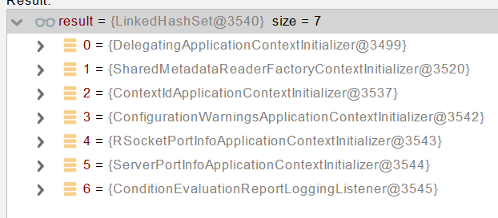

[TOC]

# SpringBoot原理

> @SpringBootApplication 是一个复合注解，它由三个注解组成。

- @SpringBootConfiguration（打开是@Configuration）：表明这是一个 Java 配置类。
- @EnableAutoConfiguration：自动配置注解，会将所有符合自动配置条件的@Configuration 配置加载到 IOC 容器。
- @ComponentScan：扫描注解，自动扫描符合条件的组件（@Service、@Component）或者 bean 定义，记载到 IOC 容器中。

## 1、SpringBoot启动过程

- 创建 **SpringApplication**

- - 保存一些信息。
  - 判定当前应用的类型。ClassUtils。Servlet
  - **bootstrappers****：初始启动引导器（**List<Bootstrapper>**）：去spring.factories文件中找** org.springframework.boot.**Bootstrapper**
  - 找 **ApplicationContextInitializer**；去**spring.factories****找** **ApplicationContextInitializer**

- - - List<ApplicationContextInitializer<?>> **initializers**

- - **找** **ApplicationListener  ；应用监听器。**去**spring.factories****找** **ApplicationListener**

- - - List<ApplicationListener<?>> **listeners**

- 运行 **SpringApplication**

- - **StopWatch**
  - **记录应用的启动时间**
  - **创建引导上下文（Context环境）****createBootstrapContext()**

- - - 获取到所有之前的 **bootstrappers 挨个执行** intitialize() 来完成对引导启动器上下文环境设置

- - 让当前应用进入**headless**模式。**java.awt.headless**
  - **获取所有** **RunListener****（运行监听器）【为了方便所有Listener进行事件感知】**

- - - getSpringFactoriesInstances 去**spring.factories****找** **SpringApplicationRunListener**. 

- - 遍历 **SpringApplicationRunListener 调用 starting 方法；**

- - - **相当于通知所有感兴趣系统正在启动过程的人，项目正在 starting。**

- - 保存命令行参数；ApplicationArguments
  - 准备环境 prepareEnvironment（）;

- - - 返回或者创建基础环境信息对象。**StandardServletEnvironment**
    - **配置环境信息对象。**

- - - - **读取所有的配置源的配置属性值。**

- - - 绑定环境信息
    - 监听器调用 listener.environmentPrepared()；通知所有的监听器当前环境准备完成

- - 创建IOC容器（createApplicationContext（））

- - - 根据项目类型（Servlet）创建容器，
    - 当前会创建 **AnnotationConfigServletWebServerApplicationContext**

- - **准备ApplicationContext IOC容器的基本信息**   **prepareContext()**

- - - 保存环境信息
    - IOC容器的后置处理流程。
    - 应用初始化器；applyInitializers；

- - - - 遍历所有的 **ApplicationContextInitializer 。调用** **initialize.。来对ioc容器进行初始化扩展功能**
      - 遍历所有的 listener 调用 **contextPrepared。EventPublishRunListenr；通知所有的监听器contextPrepared**

- - - **所有的监听器 调用** **contextLoaded。通知所有的监听器 contextLoaded；**

- - **刷新IOC容器。**refreshContext

- - - 创建容器中的所有组件（Spring注解）

- - 容器刷新完成后工作？afterRefresh
  - 所有监听 器 调用 listeners.**started**(context); **通知所有的监听器** **started**
  - **调用所有runners；**callRunners()

- - - **获取容器中的** **ApplicationRunner** 
    - **获取容器中的**  **CommandLineRunner**
    - **合并所有runner并且按照@Order进行排序**
    - **遍历所有的runner。调用 run** **方法**

- - **如果以上有异常，**

- - - **调用Listener 的 failed**

- - **调用所有监听器的 running 方法**  listeners.running(context); **通知所有的监听器** **running** 
  - **running如果有问题。继续通知 failed 。****调用所有 Listener 的** **failed；****通知所有的监听器** **failed**


```java
public interface Bootstrapper {

    /**
     * Initialize the given {@link BootstrapRegistry} with any required registrations.
     * @param registry the registry to initialize
     */
    void intitialize(BootstrapRegistry registry);

}
```




```java
@FunctionalInterface
public interface ApplicationRunner {

    /**
     * Callback used to run the bean.
     * @param args incoming application arguments
     * @throws Exception on error
     */
    void run(ApplicationArguments args) throws Exception;

}
@FunctionalInterface
public interface CommandLineRunner {

    /**
     * Callback used to run the bean.
     * @param args incoming main method arguments
     * @throws Exception on error
     */
    void run(String... args) throws Exception;

}
```

##  

## 2、Application Events and Listeners

https://docs.spring.io/spring-boot/docs/current/reference/html/spring-boot-features.html#boot-features-application-events-and-listeners

**ApplicationContextInitializer**

**ApplicationListener**

**SpringApplicationRunListener**


## 3、ApplicationRunner 与 CommandLineRunner


