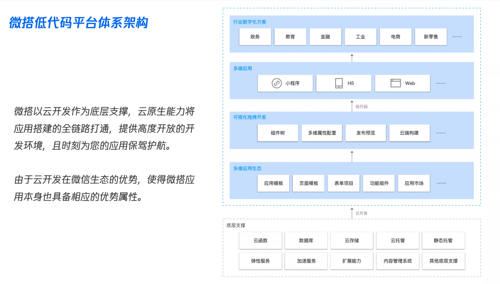
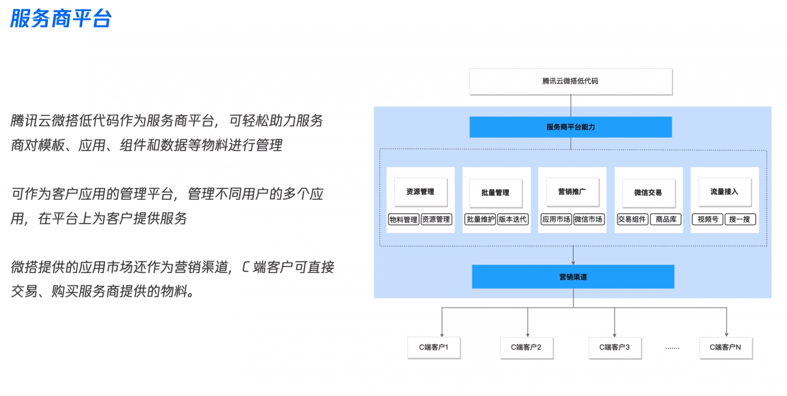
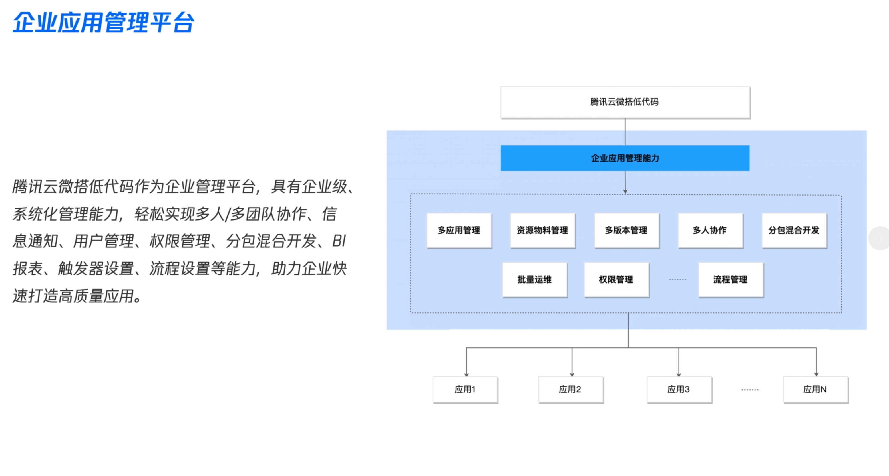
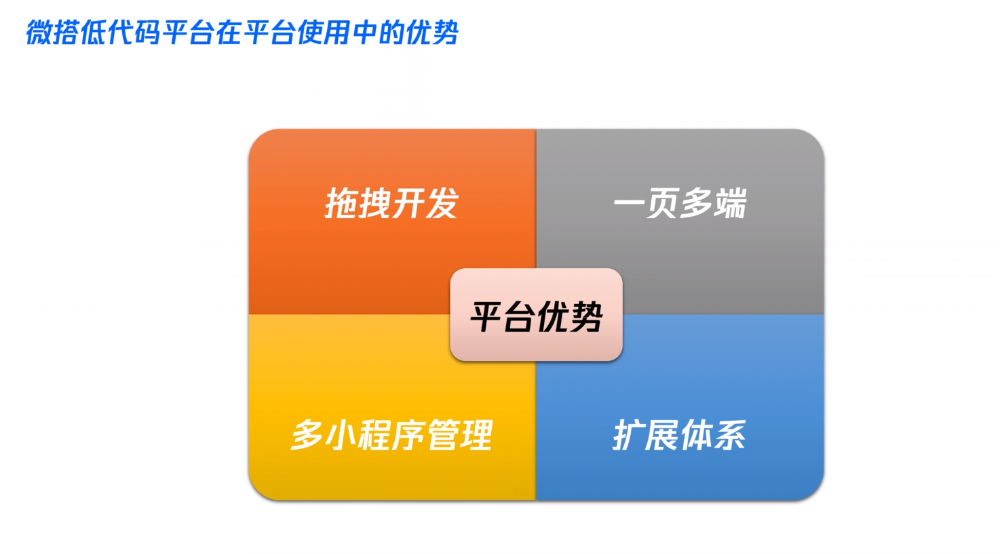
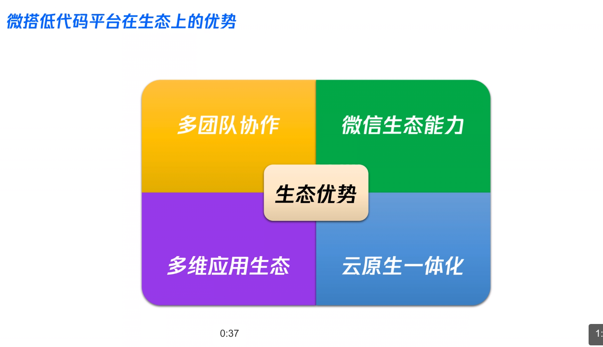

# WeDa 腾讯云微搭低代码产品通识

## 1. 课程介绍

- 实现业务应用的快速交付

- 降低业务应用的开发成本

  

## 2. 平台整体介绍

### 2.1平台基本介绍

**`以极致的效率,解决产品应用需求和供应的各种问题`**

**向上连接前端的行业业务,向下连接云计算的流量能力,助力企业垂直上云**

### 2.2 技术架构

### 2.3 支持端介绍

- 可用于多端下的开发,拖拽一份代码,可自适应部署到多端

## 总结

- ### 底代码平台的产生意义

  

- ### 底代码平台想要解决什么问题

  

  快速开发与降低成本

  各个行业的一些成熟的高可用,高复制,高配置的组件做一些生态化

- ### 微搭第代码平台的整体技术架构,底层云开发的关系

  云开发作为一个技术支撑,上层连接一些行业化的各种各样的生态模式,组成整个微搭底代码平台的技术架构

- ### 微搭低代码平台支持那些应用端

  小程序

  H5

  PC Web

## 3. 应用场景

### 介绍

- ISV, 个人开发者, 中小企业
- 作为服务商平台的场景

### 3.1 开发平台

- 可实现多端多行业的可视化开发

### 3.2 服务商平台

### 3.3 企业应用管理平台

## 4. 核心能力

### 介绍

### 4.1 平台使用

### 4.2 生态优势

