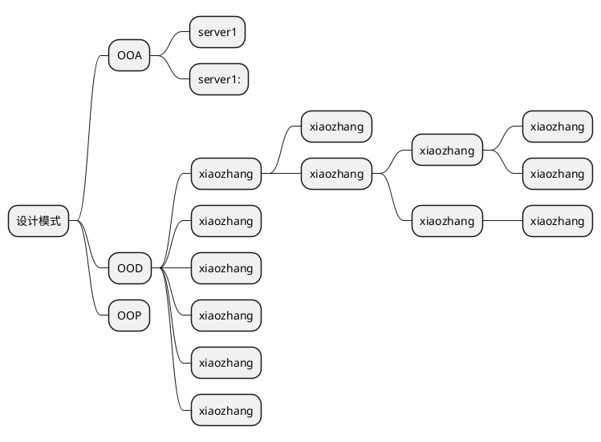

```plantuml
@startmindmap
* 设计模式
** OOA
*** server1
*** server1:
** OOD
*** xiaozhang
**** xiaozhang
**** xiaozhang

***** xiaozhang
****** xiaozhang
****** xiaozhang
***** xiaozhang
****** xiaozhang
*** xiaozhang
*** xiaozhang
*** xiaozhang
*** xiaozhang
*** xiaozhang
** OOP
@endmindmap
```

