## 介绍

在hostA上使用docker标准安装时序数据库 Influxdb 和 VictoriaMetrics，然后使用docker安装一个容器性能分析工具 cAdvisor 来采集容器运行时的相关指标。

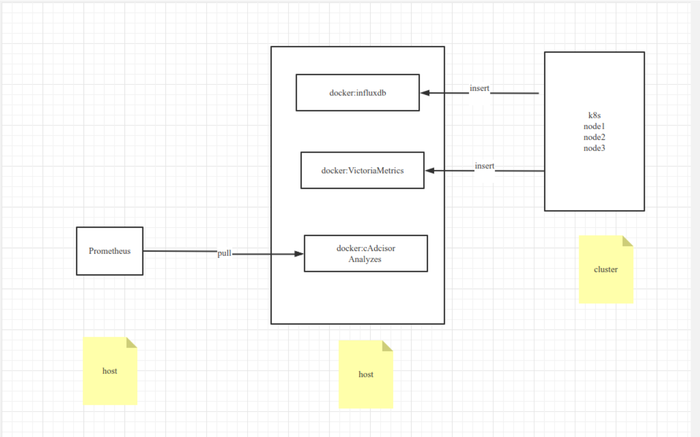

## 环境

- hostA: 178.104.163.175 2c 4g 服务：cadvisor、influxdb、VictoriaMetrics
- hostB: 178.104.163.111 2c 4g 服务：prometheus

- k8s集群：178.104.163.88

## 开始

- install cadvisor

```bash
docker run -d \
    --name cadvisor \
    -p 8080:8080 \
    -v /:/rootfs:ro \
    -v /var/run/:/var/run/:rw \
    -v /sys/:/sys/:ro \
    -v /var/lib/docker/:/var/lib/docker/:ro \
    -v /dev/disk/:/dev/disk/:ro \
    google/cadvisor:latest
```

- install influxdb

```bash
docker run -p 8086:8086 -d \
      --name influxdb \
      -v influxdb:/var/lib/influxdb \
      influxdb:1.8
      
docker run -p 8087:8086 -d \
      --name influxar \
      -v /root/influxar:/var/lib/influxdb \
      harbor.archeros.cn/library/influxdb:v1.6.0_cluster
      

docker run -p 8086:8086 -d \
      -v influxdb:/var/lib/influxdb \
      -v influxdb2:/var/lib/influxdb2 \
      -e DOCKER_INFLUXDB_INIT_MODE=upgrade \
      -e DOCKER_INFLUXDB_INIT_USERNAME=root \
      -e DOCKER_INFLUXDB_INIT_PASSWORD=huayun@123 \
      -e DOCKER_INFLUXDB_INIT_ORG=huayun \
      -e DOCKER_INFLUXDB_INIT_BUCKET=prometheus \
      influxdb
      
export INFLUX_USERNAME=root
export INFLUX_PASSWORD=huayun@123
export DOCKER_INFLUXDB_INIT_USERNAME=root
export DOCKER_INFLUXDB_INIT_PASSWORD=huayun@123

influx config create --config-name config01 \
--host-url http://178.104.163.111:8086 \
--org my-org \
--token POPKjIwNmKKBga0CNrDWV4LlnEMY-zcz6F79fYa8yTpHOBz72rxtYUJZ1kXiCsaMvWjrx57nkCHFKiXvdyuqGg== \
--active

influx write  --bucket my-bucket --precision s "m v=2 $(date +%s)"

```

- install VictoriaMetrics

```bash
docker run -it -d \
    --name vm \
    -v /root/victoria-metrics-data:/victoria-metrics-data \
    -p 8428:8428 \
    victoriametrics/victoria-metrics:latest
```

- install prometheus

```bash
docker run \
    -p 9090:9090 \
    -v /root/prometheus-2.36.2.linux-amd64/prometheus.yml:/etc/prometheus/prometheus.yml \
    prom/prometheus

将cadvisor的地址 178.104.163.175:8080 添加进prometheus.yml
```

## 测试结果

运行时间46小时

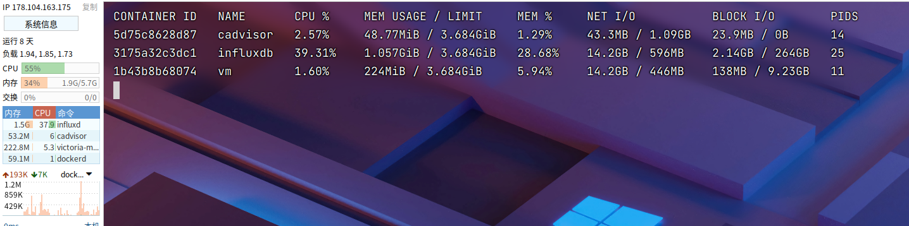

- CPU 

  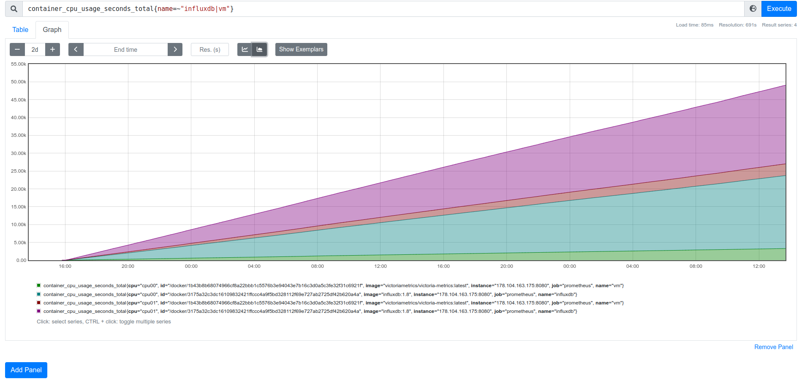

  使用率图表

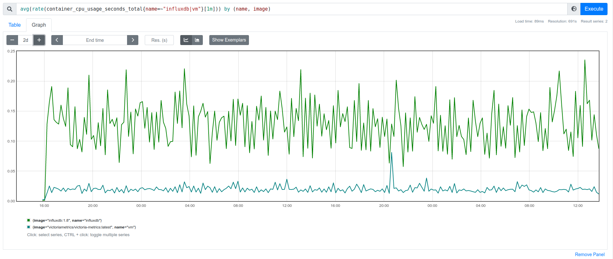

- 内存 

  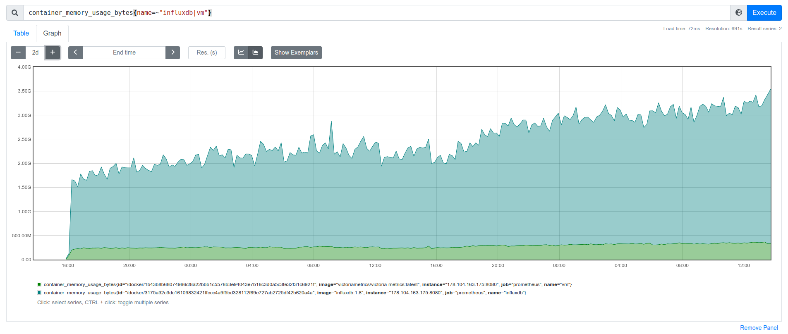

  rss

  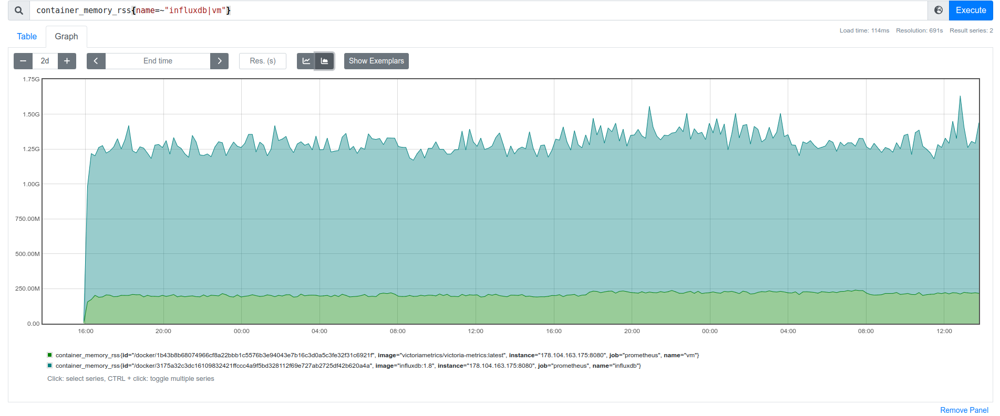

- 磁盘

  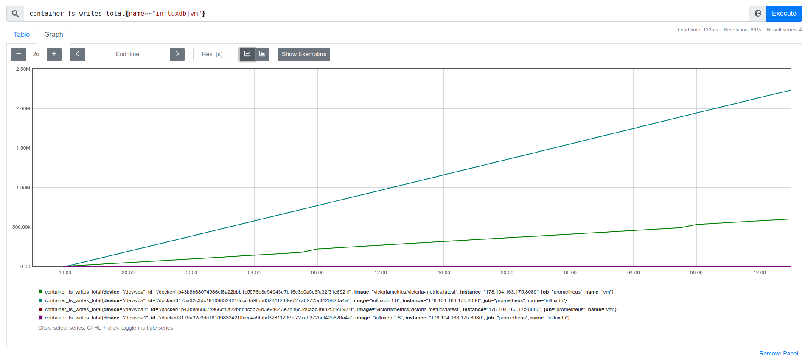

  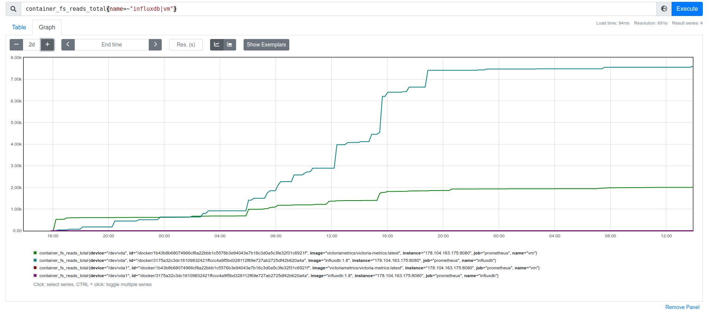

io

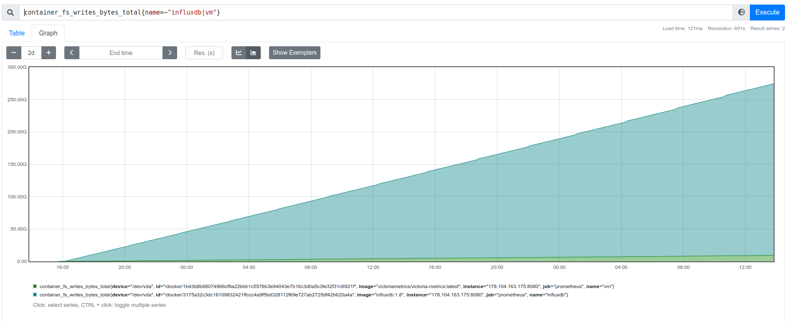

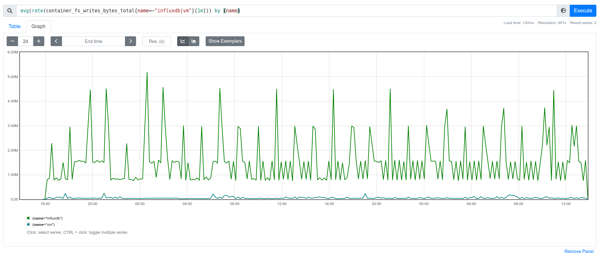

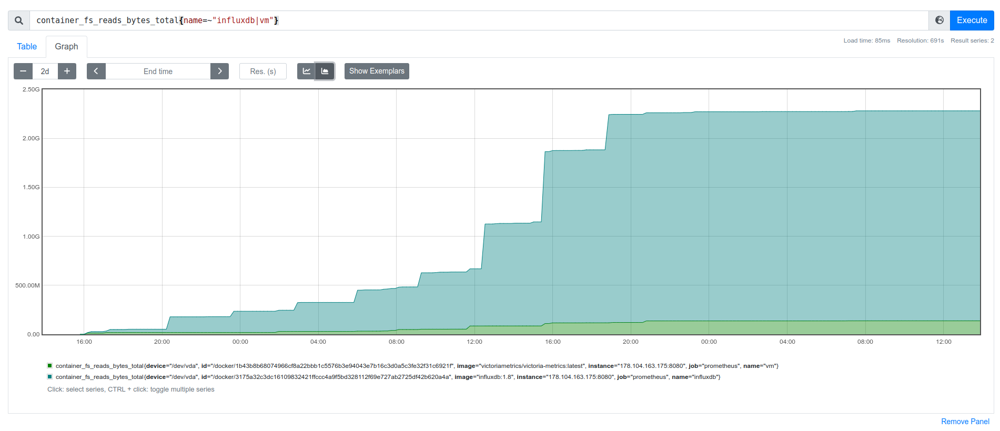

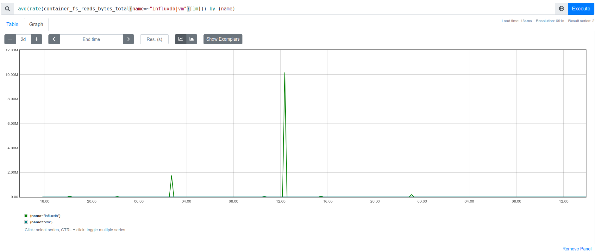

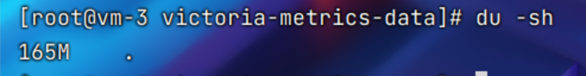

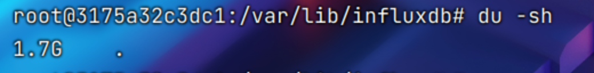